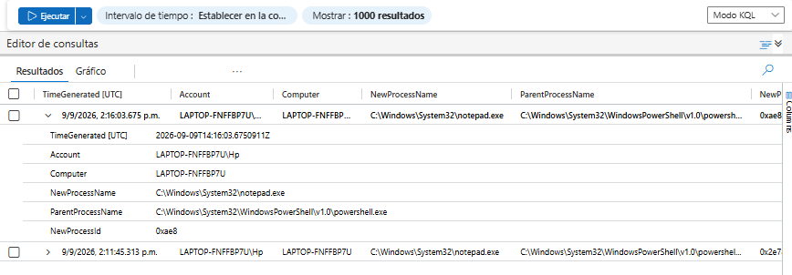
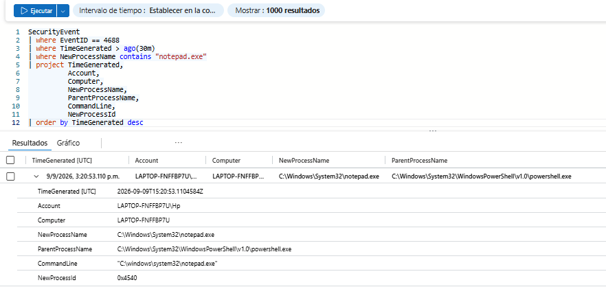
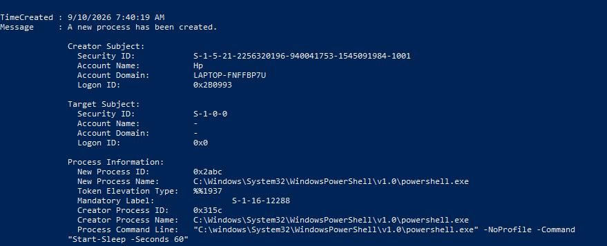
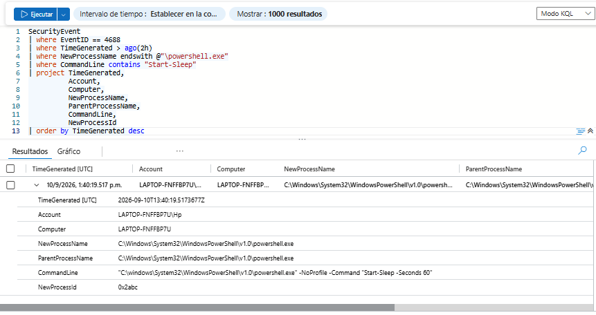
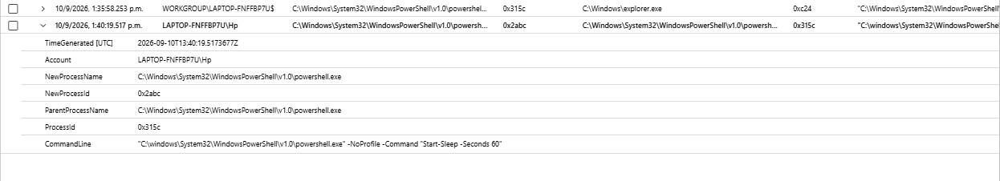
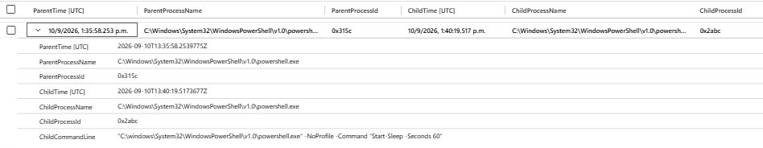

# INC-002 — Análisis de creación y relación de procesos

## 1. Resumen

Durante esta investigación se analizaron eventos de creación de procesos de Windows mediante Microsoft Sentinel utilizando el Event ID 4688.

El objetivo fue identificar procesos creados en el endpoint, analizar la relación entre procesos padre e hijo, obtener la línea de comandos utilizada y reconstruir una cadena de ejecución mediante la correlación de identificadores de proceso (PID).

La investigación se realizó mediante actividad controlada dentro del laboratorio SOC.

---

## 2. Fuente de datos

La investigación utilizó eventos del registro de seguridad de Windows enviados a Microsoft Sentinel.

**Tabla utilizada:**

`SecurityEvent`

**Evento analizado:**

`Event ID 4688 - A new process has been created`

Los eventos fueron recopilados desde el endpoint Windows y enviados al Log Analytics Workspace utilizado por Microsoft Sentinel.

---

## 3. Campos analizados

Durante la investigación se utilizaron principalmente los siguientes campos:

| Campo | Descripción |
|---|---|
| TimeGenerated | Fecha y hora asociada al evento en Sentinel |
| Account | Cuenta asociada con la creación del proceso |
| Computer | Equipo que generó el evento |
| NewProcessName | Nombre y ruta del nuevo proceso creado |
| ParentProcessName | Proceso que creó al nuevo proceso |
| NewProcessId | PID asignado al nuevo proceso |
| ProcessId | PID del proceso creador |
| CommandLine | Línea de comandos utilizada para iniciar el nuevo proceso |

Estos campos permiten analizar no solamente qué proceso fue ejecutado, sino también qué proceso lo inició y bajo qué parámetros.

---

## 4. Identificación de una relación PowerShell → Notepad

Como primera prueba controlada se inició `notepad.exe` desde PowerShell.

Microsoft Sentinel registró un Event ID 4688 donde se observó:

- `NewProcessName`: `notepad.exe`
- `ParentProcessName`: `powershell.exe`
- Cuenta asociada al usuario del laboratorio.
- Endpoint donde ocurrió la ejecución.

Esto permitió identificar una relación padre-hijo:

```text
powershell.exe
      │
      └──► notepad.exe
```

### Evidencia



---

## 5. Análisis de CommandLine

Inicialmente, los eventos 4688 permitían identificar los procesos creados, pero la información de `CommandLine` no estaba disponible.

Se habilitó en Windows la inclusión de la línea de comandos en los eventos de creación de procesos.

Posteriormente se generó un nuevo proceso `notepad.exe`.

Sentinel mostró:

- `NewProcessName`: `notepad.exe`
- `ParentProcessName`: `powershell.exe`
- `CommandLine`: línea de comandos utilizada para iniciar Notepad.
- `NewProcessId`: identificador del proceso creado.

La disponibilidad de `CommandLine` proporciona contexto adicional sobre la forma en que un proceso fue ejecutado.

### Evidencia



---

## 6. Generación de una ejecución controlada de PowerShell

Para analizar con mayor precisión la creación de procesos se realizó una prueba controlada generando una nueva instancia de PowerShell desde otra instancia de PowerShell.

La ejecución utilizada contenía los argumentos:

```text
-NoProfile -Command "Start-Sleep -Seconds 60"
```

Windows registró localmente un Event ID 4688 con información sobre:

- Proceso creado.
- PID del nuevo proceso.
- Proceso creador.
- PID del proceso creador.
- Línea de comandos.

La actividad fue generada únicamente con fines de validación dentro del laboratorio.

### Evidencia



---

## 7. Validación de la ingesta en Microsoft Sentinel

Posteriormente se buscó el mismo evento en Microsoft Sentinel.

El evento fue identificado utilizando la información de `CommandLine`, específicamente el comando `Start-Sleep`.

Sentinel mostró:

```text
NewProcessName    = powershell.exe
ParentProcessName = powershell.exe
CommandLine       = powershell.exe -NoProfile -Command "Start-Sleep -Seconds 60"
NewProcessId      = 0x2abc
```

El `NewProcessId` observado en Sentinel coincidió con el PID registrado en el evento local de Windows.

Esto permitió validar el flujo:

```text
Windows Security Event 4688
        ↓
Azure Monitor Agent
        ↓
Log Analytics Workspace
        ↓
Microsoft Sentinel
```

### Evidencia



---

## 8. Correlación mediante PID

Para reconstruir la relación entre procesos se analizaron dos campos:

```text
NewProcessId
ProcessId
```

En un evento 4688, `NewProcessId` identifica al proceso que acaba de ser creado.

`ProcessId` permite identificar el PID del proceso creador asociado al evento.

Durante la investigación se observó:

```text
PowerShell padre
NewProcessId = 0x315c
```

Posteriormente, otro evento mostró:

```text
PowerShell hijo
ProcessId    = 0x315c
NewProcessId = 0x2abc
```

La coincidencia:

```text
NewProcessId = 0x315c
       │
       └──────────────► ProcessId = 0x315c
```

permitió establecer la relación entre ambos eventos.

### Evidencia



---

## 9. Reconstrucción de la cadena de procesos

Mediante la correlación de los eventos fue posible reconstruir la siguiente cadena:

```text
explorer.exe
     │
     ▼
powershell.exe
PID 0x315c
     │
     ▼
powershell.exe
PID 0x2abc
     │
     └── CommandLine:
         -NoProfile -Command
         "Start-Sleep -Seconds 60"
```

Esta relación no se determinó únicamente mediante los nombres de los ejecutables.

La correlación se apoyó en:

- Marca temporal.
- Equipo.
- `NewProcessId`.
- `ProcessId`.
- `ParentProcessName`.
- `NewProcessName`.
- `CommandLine`.

---

## 10. Correlación automática con KQL

Después de realizar la correlación manual, se utilizó KQL para relacionar automáticamente eventos de creación de procesos.

La lógica compara:

```text
NewProcessId del proceso padre
             =
ProcessId registrado en el evento del proceso hijo
```

Esto permitió obtener automáticamente una relación:

```text
powershell.exe
PID 0x315c
      │
      ▼
powershell.exe
PID 0x2abc
```

junto con la línea de comandos utilizada por el proceso hijo.

### Evidencia



---

## 11. Análisis de seguridad

La presencia de `powershell.exe` no implica por sí sola actividad maliciosa.

PowerShell es una herramienta legítima utilizada tanto por usuarios y administradores como por aplicaciones y servicios del sistema.

Durante la investigación también se observaron ejecuciones de PowerShell asociadas con componentes de Azure, demostrando la importancia de analizar el contexto antes de clasificar una ejecución como sospechosa.

Para evaluar una ejecución de PowerShell deben considerarse elementos como:

- Proceso padre.
- Cuenta asociada.
- Línea de comandos.
- Procesos hijos.
- Momento de ejecución.
- Equipo afectado.
- Contexto operativo.

---

## 12. Clasificación

La actividad analizada fue generada intencionalmente como parte del laboratorio.

Por lo tanto, no se identificó evidencia de compromiso ni actividad maliciosa.

**Clasificación:**

`Actividad esperada - Prueba de seguridad controlada`

No se requiere escalamiento ni contención.

---

## 13. Conclusión

La investigación permitió analizar eventos de creación de procesos utilizando Event ID 4688 y Microsoft Sentinel.

Se consiguió:

- Identificar procesos creados.
- Identificar procesos padre.
- Obtener líneas de comandos.
- Correlacionar procesos mediante PID.
- Validar eventos localmente en Windows.
- Confirmar su ingesta en Microsoft Sentinel.
- Reconstruir relaciones padre-hijo.
- Automatizar parte de la correlación mediante KQL.

El análisis demuestra que la investigación de procesos requiere contexto adicional y que el nombre de un ejecutable por sí solo no es suficiente para determinar comportamiento malicioso.

---

## 14. Habilidades aplicadas

Durante INC-002 se aplicaron conocimientos de:

- Microsoft Sentinel
- Kusto Query Language (KQL)
- Windows Security Events
- Event ID 4688
- Process Creation Auditing
- Process ID (PID)
- Parent/Child Process Analysis
- Command-Line Analysis
- Process Tree Analysis
- Event Correlation
- Endpoint Investigation
- SOC Triage
- Documentación técnica
