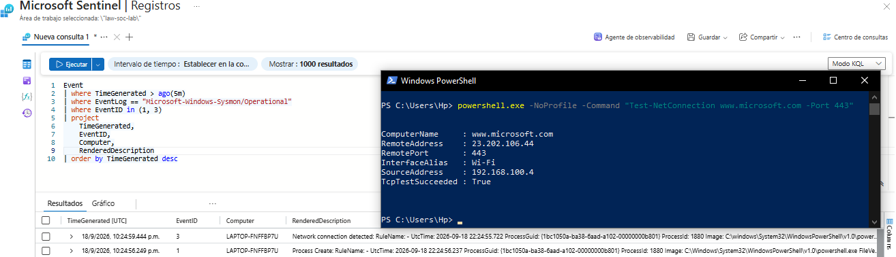
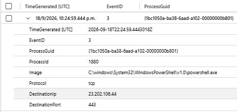
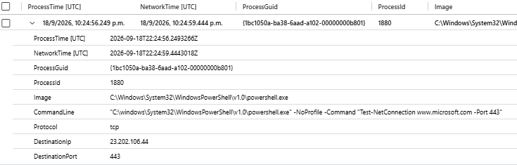
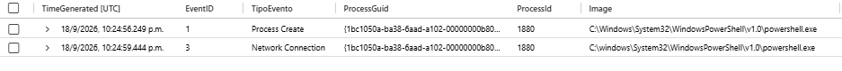

# INC-003 — Investigación de procesos y conexiones de red con Sysmon

## Resumen

En esta investigación se utilizó telemetría de Sysmon recopilada por Microsoft Sentinel para correlacionar la creación de un proceso con una conexión de red realizada por ese mismo proceso.

La investigación utiliza principalmente:

```text
Sysmon Event ID 1 — Process Create
Sysmon Event ID 3 — Network Connection
```

El objetivo fue demostrar cómo un analista SOC puede relacionar diferentes eventos utilizando identificadores de proceso, especialmente `ProcessGuid`.

Durante la prueba controlada se ejecutó PowerShell con el comando:

```powershell
Test-NetConnection www.microsoft.com -Port 443
```

La actividad generó eventos de creación de proceso y conexión de red que posteriormente fueron correlacionados en Microsoft Sentinel.

---

## Objetivo

El objetivo de INC-003 es investigar la relación entre:

```text
Proceso creado
      ↓
Comando ejecutado
      ↓
Conexión de red
      ↓
Destino y puerto
```

Para realizar la correlación se utilizaron principalmente:

```text
ProcessGuid
ProcessId
Image
CommandLine
DestinationIp
DestinationPort
```

Esto permite determinar si un proceso específico realizó actividad de red.

---

## Fuente de datos

Los eventos utilizados provienen de Sysmon y fueron enviados a Microsoft Sentinel mediante Azure Monitor Agent y una Data Collection Rule.

### Canal de eventos

```text
Microsoft-Windows-Sysmon/Operational
```

### Tabla utilizada

```text
Event
```

### Eventos investigados

```text
Event ID 1 — Process Create
Event ID 3 — Network Connection
```

---

## 1. Generación de actividad controlada

Para generar actividad que pudiera ser investigada se utilizó PowerShell.

El comando ejecutado fue:

```powershell
powershell.exe -NoProfile -Command "Test-NetConnection www.microsoft.com -Port 443"
```

Este comando realiza una prueba de conectividad hacia el puerto HTTPS 443.

Después de ejecutar el comando, Microsoft Sentinel recibió eventos Sysmon relacionados con la creación del proceso y la conexión de red.

La consulta inicial utilizada fue:

```kusto
Event
| where TimeGenerated > ago(1h)
| where EventLog == "Microsoft-Windows-Sysmon/Operational"
| where EventID in (1, 3)
| project
    TimeGenerated,
    EventID,
    Computer,
    RenderedDescription
| order by TimeGenerated desc
```

### Evidencia



---

## 2. Análisis del Event ID 1 — Process Create

El Event ID 1 permitió identificar la creación del proceso de PowerShell utilizado durante la prueba.

Se observaron los siguientes datos:

```text
ProcessGuid:
{1bc1050a-ba38-6aad-a102-00000000b801}

ProcessId:
1880

Image:
C:\Windows\System32\WindowsPowerShell\v1.0\powershell.exe

CommandLine:
powershell.exe -NoProfile -Command "Test-NetConnection www.microsoft.com -Port 443"

User:
LAPTOP-FNFFBP7U\Hp
```

También se identificó información relacionada con el proceso padre:

```text
ParentImage:
C:\Windows\System32\WindowsPowerShell\v1.0\powershell.exe
```

El campo más importante para continuar la investigación fue:

```text
ProcessGuid
```

Este identificador permite correlacionar eventos relacionados con el mismo proceso.

---

## 3. Análisis del Event ID 3 — Network Connection

Posteriormente se analizó el Event ID 3 asociado al mismo `ProcessGuid`.

La conexión identificada contenía:

```text
ProcessGuid:
{1bc1050a-ba38-6aad-a102-00000000b801}

ProcessId:
1880

Image:
C:\Windows\System32\WindowsPowerShell\v1.0\powershell.exe

Protocol:
tcp

SourceIp:
192.168.100.4

SourcePort:
50267

DestinationIp:
23.202.106.44

DestinationPort:
443

DestinationPortName:
https
```

El valor:

```text
Initiated: true
```

indica que la conexión fue iniciada por el endpoint.

La coincidencia entre `ProcessGuid`, `ProcessId` e `Image` permitió relacionar este evento con el proceso de PowerShell analizado anteriormente.

### Consulta utilizada

```kusto
Event
| where TimeGenerated > ago(1h)
| where EventLog == "Microsoft-Windows-Sysmon/Operational"
| where EventID == 3
| where RenderedDescription contains "{1bc1050a-ba38-6aad-a102-00000000b801}"
| extend ProcessGuid = extract(@"ProcessGuid:\s*(\{[^}]+\})", 1, RenderedDescription)
| extend ProcessId = extract(@"ProcessId:\s*(\d+)", 1, RenderedDescription)
| extend Image = extract(@"Image:\s*(.*?)\s+User:", 1, RenderedDescription)
| extend Protocol = extract(@"Protocol:\s*(\S+)", 1, RenderedDescription)
| extend DestinationIp = extract(@"DestinationIp:\s*(\S+)", 1, RenderedDescription)
| extend DestinationPort = extract(@"DestinationPort:\s*(\d+)", 1, RenderedDescription)
| project
    TimeGenerated,
    EventID,
    ProcessGuid,
    ProcessId,
    Image,
    Protocol,
    DestinationIp,
    DestinationPort
| order by TimeGenerated desc
```

### Evidencia



---

## 4. Correlación mediante ProcessGuid

Después de analizar los eventos individualmente, se realizó una correlación automática utilizando KQL.

La lógica utilizada fue:

```text
Event ID 1
Process Create
      │
      │ ProcessGuid
      ▼
Event ID 3
Network Connection
```

Ambos eventos contenían:

```text
ProcessGuid:
{1bc1050a-ba38-6aad-a102-00000000b801}
```

Esto permitió determinar que el proceso de PowerShell creado mediante el Event ID 1 fue el mismo proceso asociado a la conexión registrada en el Event ID 3.

### Consulta KQL

```kusto
Event
| where TimeGenerated > ago(24h)
| where EventLog == "Microsoft-Windows-Sysmon/Operational"
| where EventID == 1
| extend ProcessGuid = extract(@"ProcessGuid:\s*(\{[^}]+\})", 1, RenderedDescription)
| extend ProcessId = extract(@"ProcessId:\s*(\d+)", 1, RenderedDescription)
| extend Image = extract(@"Image:\s*(.*?)\s+FileVersion:", 1, RenderedDescription)
| extend CommandLine = extract(@"CommandLine:\s*(.*?)\s+CurrentDirectory:", 1, RenderedDescription)
| project
    ProcessTime = TimeGenerated,
    ProcessGuid,
    ProcessId,
    Image,
    CommandLine
| join kind=inner (
    Event
    | where TimeGenerated > ago(24h)
    | where EventLog == "Microsoft-Windows-Sysmon/Operational"
    | where EventID == 3
    | extend ProcessGuid = extract(@"ProcessGuid:\s*(\{[^}]+\})", 1, RenderedDescription)
    | extend DestinationIp = extract(@"DestinationIp:\s*(\S+)", 1, RenderedDescription)
    | extend DestinationPort = extract(@"DestinationPort:\s*(\d+)", 1, RenderedDescription)
    | extend Protocol = extract(@"Protocol:\s*(\S+)", 1, RenderedDescription)
    | project
        NetworkTime = TimeGenerated,
        ProcessGuid,
        DestinationIp,
        DestinationPort,
        Protocol
) on ProcessGuid
| where ProcessGuid == "{1bc1050a-ba38-6aad-a102-00000000b801}"
| project
    ProcessTime,
    NetworkTime,
    ProcessGuid,
    ProcessId,
    Image,
    CommandLine,
    Protocol,
    DestinationIp,
    DestinationPort
| order by ProcessTime desc
```

### Resultado

La correlación permitió obtener en una sola vista:

```text
ProcessId:
1880

ProcessGuid:
{1bc1050a-ba38-6aad-a102-00000000b801}

Image:
powershell.exe

CommandLine:
Test-NetConnection www.microsoft.com -Port 443

Protocol:
tcp

DestinationIp:
23.202.106.44

DestinationPort:
443
```

### Evidencia



---

## 5. Línea temporal

También se construyó una vista temporal simplificada de los eventos asociados al mismo proceso.

Consulta utilizada:

```kusto
Event
| where TimeGenerated > ago(24h)
| where EventLog == "Microsoft-Windows-Sysmon/Operational"
| where EventID in (1, 3)
| where RenderedDescription contains "{1bc1050a-ba38-6aad-a102-00000000b801}"
| extend TipoEvento = iff(EventID == 1, "Process Create", "Network Connection")
| extend ProcessGuid = extract(@"ProcessGuid:\s*(\{[^}]+\})", 1, RenderedDescription)
| extend ProcessId = extract(@"ProcessId:\s*(\d+)", 1, RenderedDescription)
| extend Image = extract(@"Image:\s*(.*?)\s+(FileVersion:|User:)", 1, RenderedDescription)
| extend CommandLine = extract(@"CommandLine:\s*(.*?)\s+CurrentDirectory:", 1, RenderedDescription)
| extend DestinationIp = extract(@"DestinationIp:\s*(\S+)", 1, RenderedDescription)
| extend DestinationPort = extract(@"DestinationPort:\s*(\d+)", 1, RenderedDescription)
| project
    TimeGenerated,
    EventID,
    TipoEvento,
    ProcessGuid,
    ProcessId,
    Image,
    CommandLine,
    DestinationIp,
    DestinationPort
| order by TimeGenerated asc
```

Durante la revisión se observó que los tiempos de generación de los eventos podían diferir por milisegundos.

Por esta razón, la correlación no se basó únicamente en el orden temporal.

El identificador principal utilizado para relacionar los eventos fue:

```text
ProcessGuid
```

### Evidencia



---

## Análisis SOC

La investigación permitió reconstruir la siguiente actividad:

```text
PowerShell
    │
    ├── ProcessId: 1880
    │
    ├── ProcessGuid:
    │   {1bc1050a-ba38-6aad-a102-00000000b801}
    │
    ├── CommandLine:
    │   Test-NetConnection www.microsoft.com -Port 443
    │
    └── Network Connection
            │
            ├── Protocol: TCP
            ├── DestinationIp: 23.202.106.44
            └── DestinationPort: 443
```

El análisis permitió comprobar que la creación del proceso y la conexión de red correspondían al mismo proceso de PowerShell.

La relación fue validada utilizando:

```text
ProcessGuid
ProcessId
Image
```

El campo `CommandLine` proporcionó contexto adicional sobre la acción ejecutada.

---

## Importancia de ProcessGuid

Aunque `ProcessId` puede utilizarse para relacionar eventos, los identificadores de proceso pueden reutilizarse posteriormente por el sistema operativo.

Sysmon proporciona `ProcessGuid`, que permite identificar de forma más precisa una instancia concreta de un proceso dentro de la telemetría recopilada.

En esta investigación, `ProcessGuid` fue utilizado como campo principal para realizar el `join` entre Event ID 1 y Event ID 3.

---

## Clasificación

La actividad observada corresponde a una prueba controlada realizada dentro del laboratorio.

El comando:

```text
Test-NetConnection www.microsoft.com -Port 443
```

fue ejecutado intencionalmente para generar telemetría de proceso y red.

No se identificó actividad maliciosa durante esta investigación.

---

## Conclusión

INC-003 permitió avanzar desde el análisis de eventos individuales hacia la correlación de múltiples fuentes de información generadas por Sysmon.

Se logró relacionar:

```text
Process Create
      ↓
ProcessGuid
      ↓
CommandLine
      ↓
Network Connection
      ↓
Destination IP / Port
```

La investigación demostró cómo Sysmon proporciona mayor contexto sobre la actividad de un endpoint y cómo KQL puede utilizarse para reconstruir el comportamiento de un proceso.

Este tipo de correlación puede utilizarse posteriormente para desarrollar reglas de detección que combinen ejecución de procesos con actividad de red.

---

## Habilidades aplicadas

- Sysmon
- Event ID 1 — Process Create
- Event ID 3 — Network Connection
- Microsoft Sentinel
- KQL
- `extract()`
- `extend`
- `project`
- `join`
- Correlación mediante ProcessGuid
- Análisis de procesos
- Análisis de conexiones de red
- CommandLine analysis
- Endpoint investigation
- SOC investigation
