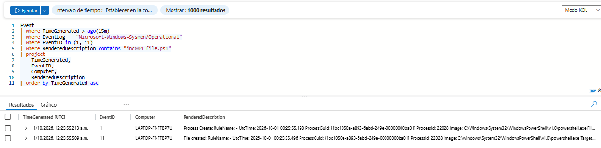
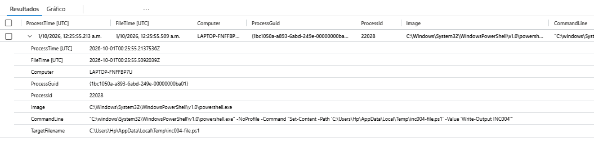
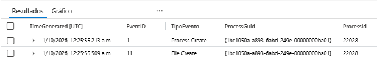

# INC-004 — Investigación de creación de archivos con Sysmon

## Resumen

En esta investigación se utilizó telemetría de Sysmon recopilada por Microsoft Sentinel para correlacionar la creación de un proceso con la creación de un archivo.

La investigación utiliza principalmente:

```text
Sysmon Event ID 1 — Process Create
Sysmon Event ID 11 — File Create
```

El objetivo fue determinar qué proceso creó un archivo específico utilizando `ProcessGuid` como identificador de correlación.

Durante la prueba controlada se utilizó PowerShell para crear un archivo `.ps1` dentro del directorio temporal del usuario.

---

## Objetivo

El objetivo de INC-004 es reconstruir la siguiente relación:

```text
Proceso creado
      ↓
CommandLine
      ↓
ProcessGuid
      ↓
Archivo creado
```

Para realizar la investigación se utilizaron principalmente:

```text
ProcessGuid
ProcessId
Image
CommandLine
TargetFilename
```

Esto permite identificar qué proceso fue responsable de crear un archivo determinado.

---

## Fuente de datos

Los eventos utilizados provienen de Sysmon y fueron enviados a Microsoft Sentinel mediante Azure Monitor Agent y una Data Collection Rule.

### Canal

```text
Microsoft-Windows-Sysmon/Operational
```

### Tabla

```text
Event
```

### Eventos investigados

```text
Event ID 1 — Process Create
Event ID 11 — File Create
```

---

## 1. Generación de actividad controlada

Para generar la actividad se ejecutó PowerShell con un comando que creó un nuevo archivo `.ps1`.

```powershell
powershell.exe -NoProfile -Command "Set-Content -Path '$env:TEMP\inc004-file.ps1' -Value 'Write-Output INC004'"
```

La ejecución generó:

```text
Event ID 1  → creación del proceso PowerShell
Event ID 11 → creación del archivo inc004-file.ps1
```

Consulta inicial:

```kusto
Event
| where TimeGenerated > ago(15m)
| where EventLog == "Microsoft-Windows-Sysmon/Operational"
| where EventID in (1, 11)
| where RenderedDescription contains "inc004-file.ps1"
| project
    TimeGenerated,
    EventID,
    Computer,
    RenderedDescription
| order by TimeGenerated asc
```

### Evidencia



---

## 2. Correlación mediante ProcessGuid

Después de identificar los eventos individualmente, se correlacionaron Event ID 1 y Event ID 11 utilizando `ProcessGuid`.

La lógica utilizada fue:

```text
Event ID 1
Process Create
      │
      │ ProcessGuid
      ▼
Event ID 11
File Create
```

La consulta utilizada fue:

```kusto
Event
| where TimeGenerated > ago(30m)
| where EventLog == "Microsoft-Windows-Sysmon/Operational"
| where EventID == 1
| extend ProcessGuid = extract(@"ProcessGuid:\s*(\{[^}]+\})", 1, RenderedDescription)
| extend ProcessId = extract(@"ProcessId:\s*(\d+)", 1, RenderedDescription)
| extend Image = extract(@"Image:\s*(.*?)\s+FileVersion:", 1, RenderedDescription)
| extend CommandLine = extract(@"CommandLine:\s*(.*?)\s+CurrentDirectory:", 1, RenderedDescription)
| where CommandLine contains "inc004-file.ps1"
| project
    ProcessTime = TimeGenerated,
    Computer,
    ProcessGuid,
    ProcessId,
    Image,
    CommandLine
| join kind=inner (
    Event
    | where TimeGenerated > ago(30m)
    | where EventLog == "Microsoft-Windows-Sysmon/Operational"
    | where EventID == 11
    | extend ProcessGuid = extract(@"ProcessGuid:\s*(\{[^}]+\})", 1, RenderedDescription)
    | extend TargetFilename = extract(@"TargetFilename:\s*(.*?)\s+CreationUtcTime:", 1, RenderedDescription)
    | project
        FileTime = TimeGenerated,
        ProcessGuid,
        TargetFilename
) on ProcessGuid
| where TargetFilename contains "inc004-file.ps1"
| project
    ProcessTime,
    FileTime,
    Computer,
    ProcessGuid,
    ProcessId,
    Image,
    CommandLine,
    TargetFilename
| order by ProcessTime desc
```

La correlación permitió obtener en una sola vista:

```text
ProcessGuid
ProcessId
Image
CommandLine
TargetFilename
```

De esta forma se confirmó que el mismo proceso de PowerShell registrado mediante Event ID 1 fue responsable de crear el archivo registrado mediante Event ID 11.

### Evidencia



---

## 3. Línea temporal

También se construyó una vista temporal de los eventos relacionados con la actividad.

Consulta utilizada:

```kusto
Event
| where TimeGenerated > ago(30m)
| where EventLog == "Microsoft-Windows-Sysmon/Operational"
| where EventID in (1, 11)
| where RenderedDescription contains "inc004-file.ps1"
| extend TipoEvento = case(
    EventID == 1, "Process Create",
    EventID == 11, "File Create",
    "Otro"
)
| extend ProcessGuid = extract(@"ProcessGuid:\s*(\{[^}]+\})", 1, RenderedDescription)
| extend ProcessId = extract(@"ProcessId:\s*(\d+)", 1, RenderedDescription)
| extend Image = extract(@"Image:\s*(\S+)", 1, RenderedDescription)
| extend CommandLine = extract(@"CommandLine:\s*(.*?)\s+CurrentDirectory:", 1, RenderedDescription)
| extend TargetFilename = extract(@"TargetFilename:\s*(.*?)\s+CreationUtcTime:", 1, RenderedDescription)
| project
    TimeGenerated,
    EventID,
    TipoEvento,
    ProcessGuid,
    ProcessId,
    Image,
    CommandLine,
    TargetFilename
| order by TimeGenerated asc
```

La línea temporal permitió observar:

```text
Event ID 1  → Process Create
Event ID 11 → File Create
```

compartiendo el mismo `ProcessGuid`.

### Evidencia



---

## Análisis SOC

La actividad investigada puede representarse de la siguiente forma:

```text
powershell.exe
      │
      ├── ProcessGuid
      ├── ProcessId
      ├── CommandLine
      │
      ▼
Set-Content
      │
      ▼
inc004-file.ps1
      │
      ▼
Sysmon Event ID 11
```

El análisis permitió determinar:

```text
Proceso:
powershell.exe

Acción:
Creación de archivo

Archivo:
inc004-file.ps1

Ubicación:
Directorio temporal del usuario
```

La relación entre el proceso y el archivo fue confirmada mediante `ProcessGuid`.

---

## Importancia de ProcessGuid

`ProcessGuid` permite relacionar diferentes eventos de Sysmon generados por una misma instancia de proceso.

En esta investigación fue utilizado para correlacionar:

```text
Process Create
+
File Create
```

Esto proporciona mayor precisión que depender únicamente de `ProcessId`, ya que los identificadores de proceso pueden reutilizarse con el tiempo.

---

## Clasificación

La actividad observada correspondió a una prueba controlada realizada dentro del laboratorio.

El archivo:

```text
inc004-file.ps1
```

fue creado intencionalmente para validar la recopilación y correlación de telemetría de Sysmon.

No se identificó comportamiento malicioso durante la investigación.

---

## Resultado

INC-004 permitió ampliar el análisis del endpoint desde procesos y conexiones de red hacia actividad relacionada con el sistema de archivos.

La investigación demostró cómo correlacionar:

```text
Sysmon Event ID 1
Process Create

        +

Sysmon Event ID 11
File Create

        ↓

ProcessGuid
```

Esto permite identificar qué proceso creó un archivo determinado y proporciona una base para desarrollar futuras detecciones relacionadas con archivos creados por PowerShell.

---

## Habilidades aplicadas

- Microsoft Sentinel
- Sysmon
- Event ID 1
- Event ID 11
- File Create analysis
- KQL
- `extract()`
- `extend`
- `project`
- `join`
- ProcessGuid correlation
- PowerShell analysis
- File activity investigation
- Endpoint investigation
- SOC investigation
