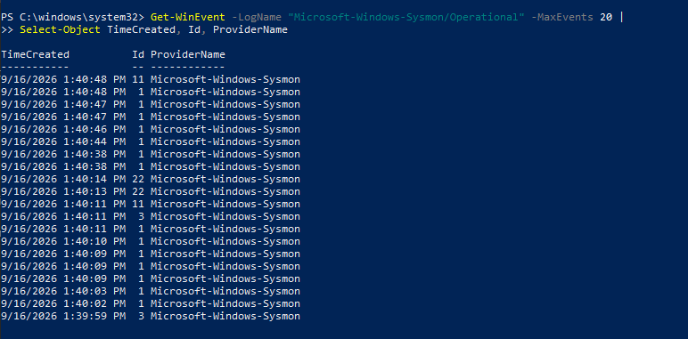
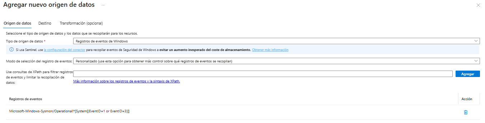
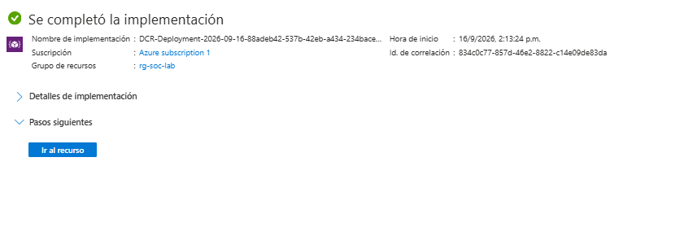
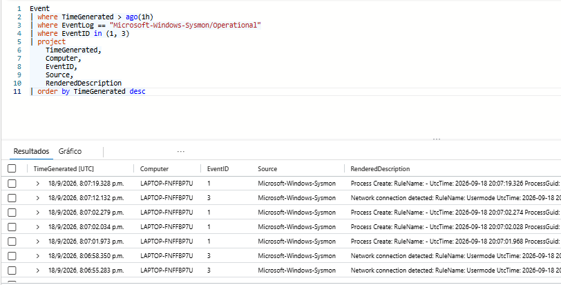

# SYS-001 — Integración de Sysmon con Microsoft Sentinel

## Resumen

En esta configuración se integró Sysmon como nueva fuente de telemetría para el laboratorio SOC basado en Microsoft Sentinel.

Sysmon ya se encontraba instalado en el endpoint Windows y generando eventos localmente. El objetivo fue configurar Azure Monitor Agent y una Data Collection Rule (DCR) para enviar eventos seleccionados de Sysmon hacia el Log Analytics Workspace utilizado por Microsoft Sentinel.

Para esta primera integración se recopilaron:

```text
Event ID 1 — Process Create
Event ID 3 — Network Connection
```

Estos eventos serán utilizados posteriormente para realizar investigaciones y desarrollar nuevas reglas de detección.

---

## Objetivo

El objetivo de SYS-001 es ampliar la visibilidad del endpoint mediante telemetría de Sysmon.

El flujo implementado es:

```text
Windows Endpoint
      ↓
Sysmon
      ↓
Microsoft-Windows-Sysmon/Operational
      ↓
Azure Monitor Agent
      ↓
Data Collection Rule
      ↓
Log Analytics Workspace
      ↓
Microsoft Sentinel
```

---

## 1. Verificación de Sysmon en el endpoint

Antes de realizar cambios en Azure se verificó que Sysmon estuviera instalado y ejecutándose correctamente.

Se utilizó PowerShell para comprobar el servicio:

```powershell
Get-Service | Where-Object {$_.Name -like "Sysmon*"}
```

El servicio fue identificado como:

```text
Sysmon64
Status: Running
```

También se comprobó que Sysmon estuviera generando eventos localmente mediante el registro:

```text
Microsoft-Windows-Sysmon/Operational
```

### Evidencia



---

## 2. Creación de Data Collection Rule para Sysmon

Se creó una nueva regla de recopilación de datos independiente de la utilizada para Windows Security Events.

Nombre de la regla:

```text
dcr-sysmon-soc-lab
```

La DCR fue asociada al endpoint Windows conectado mediante Azure Arc.

Para reducir la cantidad de telemetría enviada inicialmente, se configuró un filtro XPath para recopilar únicamente eventos Sysmon 1 y 3:

```text
Microsoft-Windows-Sysmon/Operational!*[System[(EventID=1 or EventID=3)]]
```

Esto permite recopilar:

```text
Event ID 1 → Process Create
Event ID 3 → Network Connection
```

El destino configurado fue el Log Analytics Workspace:

```text
law-soc-lab
```

### Evidencia



---

## 3. Implementación de la DCR

Después de configurar el origen de datos, el recurso de Azure Arc y el destino de Log Analytics, la regla fue implementada correctamente.

Azure confirmó la creación de la nueva Data Collection Rule dentro del grupo de recursos utilizado por el laboratorio.

### Evidencia



---

## 4. Resolución de problema de ingestión

Inicialmente los eventos Sysmon no aparecían en Microsoft Sentinel a pesar de que:

- Sysmon estaba funcionando localmente.
- Los eventos 1 y 3 estaban siendo generados.
- La DCR estaba creada.
- El endpoint estaba asociado a la DCR.
- Azure Monitor Agent aparecía instalado.

Durante el diagnóstico se revisaron los registros internos de Azure Monitor Agent.

Se identificaron respuestas HTTP 401 con el mensaje:

```text
TokenExpired
Security token is expired
```

Esto impedía que Azure Monitor Agent descargara las configuraciones más recientes asociadas al endpoint.

Después de reinstalar la extensión:

```text
Azure Monitor Agent for Windows
```

el agente volvió a descargar correctamente las configuraciones de las DCR.

Se confirmó localmente que la configuración descargada contenía:

```text
Microsoft-Windows-Sysmon/Operational!*[System[(EventID=1 or EventID=3)]]
```

Esto confirmó que Azure Monitor Agent había recibido correctamente la configuración de Sysmon.

---

## 5. Validación en Microsoft Sentinel

Una vez aplicada correctamente la DCR, se generaron nuevos eventos en el endpoint y se realizó una consulta en Microsoft Sentinel.

Consulta utilizada:

```kusto
Event
| where TimeGenerated > ago(1h)
| where EventLog == "Microsoft-Windows-Sysmon/Operational"
| where EventID in (1, 3)
| project
    TimeGenerated,
    Computer,
    EventID,
    Source,
    RenderedDescription
| order by TimeGenerated desc
```

La consulta mostró correctamente eventos provenientes de:

```text
Microsoft-Windows-Sysmon
```

incluyendo:

```text
Event ID 1 — Process Create
Event ID 3 — Network Connection
```

Esto confirmó el funcionamiento completo del flujo de recopilación.

### Evidencia



---

## Resultado

La integración de Sysmon con Microsoft Sentinel fue completada correctamente.

El laboratorio ahora dispone de una nueva fuente de telemetría capaz de proporcionar información más detallada sobre el comportamiento del endpoint.

Se verificó correctamente el flujo:

```text
Sysmon
   ↓
Event ID 1 / Event ID 3
   ↓
Azure Monitor Agent
   ↓
dcr-sysmon-soc-lab
   ↓
law-soc-lab
   ↓
Microsoft Sentinel
```

---

## Eventos disponibles

### Event ID 1 — Process Create

Permite obtener información detallada sobre procesos creados en el sistema, incluyendo datos útiles para investigar:

```text
Image
CommandLine
ParentImage
ProcessId
ParentProcessId
User
Hashes
ProcessGuid
```

Estos campos permiten reconstruir relaciones entre procesos y analizar comandos ejecutados.

### Event ID 3 — Network Connection

Permite observar conexiones de red iniciadas por procesos.

Entre la información disponible se pueden encontrar:

```text
Image
ProcessId
ProcessGuid
SourceIp
SourcePort
DestinationIp
DestinationPort
Protocol
```

Esto permite relacionar procesos con actividad de red.

---

## Aplicación dentro del laboratorio

La integración realizada en SYS-001 servirá como base para futuras investigaciones.

La siguiente etapa utilizará esta telemetría para correlacionar procesos y conexiones de red:

```text
Proceso
   ↓
Sysmon Event ID 1
   ↓
ProcessGuid / ProcessId
   ↓
Sysmon Event ID 3
   ↓
Conexión de red
```

Esto permitirá avanzar desde el análisis individual de eventos hacia investigaciones basadas en correlación de comportamiento.

---

## Habilidades aplicadas

- Sysmon
- Windows Event Logs
- Azure Arc
- Azure Monitor Agent
- Data Collection Rules
- XPath
- Log Analytics Workspace
- Microsoft Sentinel
- KQL
- Troubleshooting de telemetría
- Análisis de logs de agentes
- Validación de fuentes de datos

---

## Conclusión

SYS-001 permitió ampliar la capacidad de monitoreo del laboratorio SOC incorporando telemetría de Sysmon a Microsoft Sentinel.

Además de configurar la recopilación, fue necesario diagnosticar un problema de comunicación de Azure Monitor Agent relacionado con un token expirado.

La resolución del problema permitió validar correctamente la descarga de la DCR y la posterior ingestión de eventos Sysmon en Sentinel.

Con esta configuración completada, el laboratorio queda preparado para realizar investigaciones más avanzadas sobre procesos, conexiones de red y correlación de actividad del endpoint.
