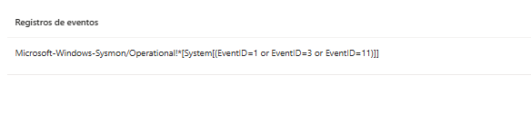
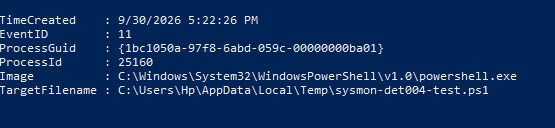
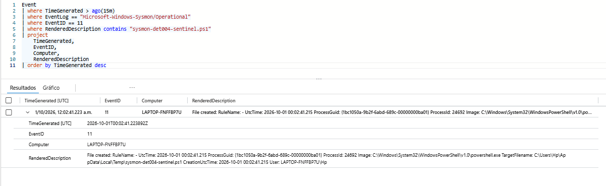

# SYS-002 — Ampliación de Sysmon con Event ID 11 File Create

## Resumen

En esta configuración se amplió la telemetría de Sysmon recopilada por Microsoft Sentinel para incluir eventos relacionados con la creación de archivos.

Hasta este punto, la Data Collection Rule utilizada para Sysmon recopilaba:

```text
Event ID 1 — Process Create
Event ID 3 — Network Connection
```

En SYS-002 se añadió:

```text
Event ID 11 — File Create
```

Esto permite comenzar a investigar relaciones entre procesos y archivos creados en el endpoint.

---

## Objetivo

El objetivo de SYS-002 es ampliar el flujo de telemetría existente:

```text
Sysmon
   ↓
Azure Monitor Agent
   ↓
Data Collection Rule
   ↓
Log Analytics Workspace
   ↓
Microsoft Sentinel
```

para incluir eventos de creación de archivos.

La nueva telemetría permitirá posteriormente correlacionar:

```text
Process Create
      ↓
ProcessGuid
      ↓
File Create
```

---

## Data Collection Rule

Se utilizó la DCR existente:

```text
dcr-sysmon-soc-lab
```

El canal utilizado continúa siendo:

```text
Microsoft-Windows-Sysmon/Operational
```

La consulta XPath fue ampliada de:

```text
Microsoft-Windows-Sysmon/Operational!*[System[(EventID=1 or EventID=3)]]
```

a:

```text
Microsoft-Windows-Sysmon/Operational!*[System[(EventID=1 or EventID=3 or EventID=11)]]
```

De esta forma la DCR recopila:

```text
Event ID 1  — Process Create
Event ID 3  — Network Connection
Event ID 11 — File Create
```

### Evidencia



---

## Validación local de Event ID 11

Antes de validar Microsoft Sentinel, se confirmó que Sysmon estaba generando correctamente Event ID 11 en el endpoint.

Se creó un archivo PowerShell de prueba:

```powershell
Set-Content "$env:TEMP\sysmon-det004-test.ps1" 'Write-Output "Prueba DET-004"'
```

Posteriormente se consultaron los eventos locales de Sysmon.

El evento obtenido contenía información como:

```text
EventID:
11

ProcessId:
25160

Image:
C:\Windows\System32\WindowsPowerShell\v1.0\powershell.exe

TargetFilename:
C:\Users\Hp\AppData\Local\Temp\sysmon-det004-test.ps1
```

También se obtuvo el campo:

```text
ProcessGuid
```

que será utilizado posteriormente para correlacionar la creación del archivo con el proceso que la originó.

### Evidencia



---

## Problema de actualización de AMA

Después de modificar la DCR, inicialmente los nuevos eventos Event ID 11 no aparecieron en Microsoft Sentinel.

Durante el diagnóstico se comprobó que Azure Monitor Agent todavía tenía cargada la configuración anterior:

```text
Event ID 1
Event ID 3
```

También se observaron errores relacionados con:

```text
TokenExpired
HTTP 401
GetConfig api returned errorcode: 401
```

Debido al token expirado, Azure Monitor Agent no estaba descargando correctamente la versión actualizada de la Data Collection Rule.

Para recuperar el flujo de telemetría se reinstaló únicamente:

```text
AzureMonitorWindowsAgent
```

Después de la reinstalación se confirmó que AMA recibió correctamente la nueva configuración:

```text
EventID=1
EventID=3
EventID=11
```

y dejaron de aparecer nuevos errores `TokenExpired`.

---

## Validación en Microsoft Sentinel

Después de recuperar Azure Monitor Agent se generó un nuevo archivo de prueba:

```powershell
Set-Content "$env:TEMP\sysmon-det004-sentinel.ps1" 'Write-Output "Prueba Sysmon Event ID 11"'
```

Posteriormente se utilizó la siguiente consulta KQL:

```kusto
Event
| where TimeGenerated > ago(15m)
| where EventLog == "Microsoft-Windows-Sysmon/Operational"
| where EventID == 11
| where RenderedDescription contains "sysmon-det004-sentinel.ps1"
| project
    TimeGenerated,
    EventID,
    Computer,
    RenderedDescription
| order by TimeGenerated desc
```

Microsoft Sentinel recibió correctamente el evento.

Entre los datos observados se encontraban:

```text
EventID:
11

Computer:
LAPTOP-FNFFBP7U

Image:
C:\Windows\System32\WindowsPowerShell\v1.0\powershell.exe

ProcessId:
24692

TargetFilename:
C:\Users\Hp\AppData\Local\Temp\sysmon-det004-sentinel.ps1
```

La aparición del evento confirmó que la nueva telemetría estaba recorriendo correctamente todo el flujo.

### Evidencia



---

## Flujo validado

El resultado final de SYS-002 fue:

```text
PowerShell
    ↓
creación de archivo .ps1
    ↓
Sysmon Event ID 11
    ↓
Azure Monitor Agent
    ↓
dcr-sysmon-soc-lab
    ↓
Log Analytics Workspace
    ↓
Microsoft Sentinel
```

---

## Resultado

SYS-002 permitió ampliar la visibilidad del endpoint incorporando eventos de creación de archivos.

Microsoft Sentinel ahora puede recopilar:

```text
Event ID 1  — Process Create
Event ID 3  — Network Connection
Event ID 11 — File Create
```

Esta nueva fuente de telemetría permitirá desarrollar investigaciones y detecciones relacionadas con archivos creados por procesos como PowerShell.

El siguiente paso será correlacionar:

```text
Event ID 1
Process Create

        +

Event ID 11
File Create

        ↓

ProcessGuid
```

para determinar qué proceso creó un archivo específico.

---

## Habilidades aplicadas

- Sysmon
- Event ID 11
- File Create monitoring
- Azure Monitor Agent
- Data Collection Rules
- XPath
- Azure Arc
- Microsoft Sentinel
- Log Analytics
- KQL
- Endpoint telemetry
- Troubleshooting de AMA
- Diagnóstico de TokenExpired
