# DET-001 - Detección de múltiples intentos fallidos de inicio de sesión

## 1. Descripción

Esta detección fue desarrollada en Microsoft Sentinel para identificar cuentas que registren múltiples intentos fallidos de inicio de sesión en un período corto de tiempo.

La regla analiza eventos de seguridad de Windows con Event ID 4625 y genera una alerta cuando una misma combinación de cuenta, equipo, dirección IP y LogonType registra 3 o más intentos fallidos dentro de una ventana de 5 minutos.

El objetivo de la detección es identificar patrones de autenticación que requieren investigación. La activación de la regla no implica por sí sola que exista actividad maliciosa.

---

## 2. Fuente de datos

La detección utiliza eventos del registro de seguridad de Windows enviados a Microsoft Sentinel.

Tabla utilizada:

`SecurityEvent`

Evento principal:

`Event ID 4625 - An account failed to log on`

Los eventos son recopilados desde el endpoint Windows mediante Azure Monitor Agent y enviados al Log Analytics Workspace utilizado por Microsoft Sentinel.

---

## 3. Lógica de detección

La consulta KQL utilizada es:

```kusto
SecurityEvent
| where EventID == 4625
| summarize IntentosFallidos=count()
    by Account, Computer, IpAddress, LogonType, bin(TimeGenerated, 5m)
| where IntentosFallidos >= 3
| order by IntentosFallidos desc
```

La consulta realiza las siguientes operaciones:

1. Consulta la tabla `SecurityEvent`.
2. Filtra únicamente los eventos con Event ID 4625.
3. Agrupa los eventos por `Account`, `Computer`, `IpAddress` y `LogonType`.
4. Agrupa temporalmente los eventos en bloques de 5 minutos mediante `bin(TimeGenerated, 5m)`.
5. Cuenta los intentos fallidos dentro de cada grupo.
6. Conserva únicamente los resultados con 3 o más intentos fallidos.
7. Ordena los resultados por cantidad de intentos.

La consulta completa y comentada se encuentra en [`deteccion.kql`](deteccion.kql).

### Evidencia

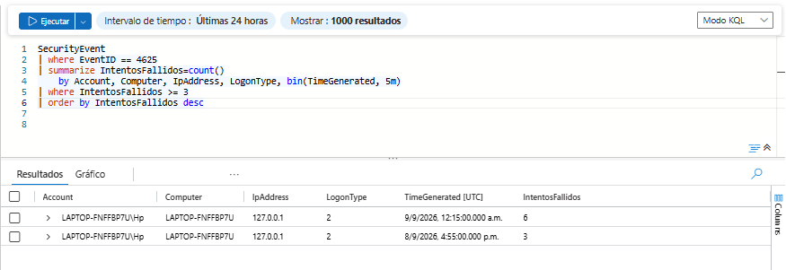

---

## 4. Configuración de la Analytics Rule

La consulta fue implementada como una Scheduled Analytics Rule en Microsoft Sentinel.

Configuración principal:

| Parámetro | Valor |
|---|---|
| Nombre | Multiple Failed Logons - 3 Attempts in 5 Minutes |
| Severidad | Low |
| Frecuencia de ejecución | 5 minutos |
| Período consultado | Últimos 5 minutos |
| Umbral de resultados | Mayor que 0 |
| Event grouping | Trigger an alert for each event |
| Suppression | Deshabilitado |
| Creación de incidentes | Habilitada |
| Alert grouping | Deshabilitado |

Se utilizó severidad `Low` porque múltiples errores de autenticación no representan necesariamente actividad maliciosa y requieren análisis contextual.

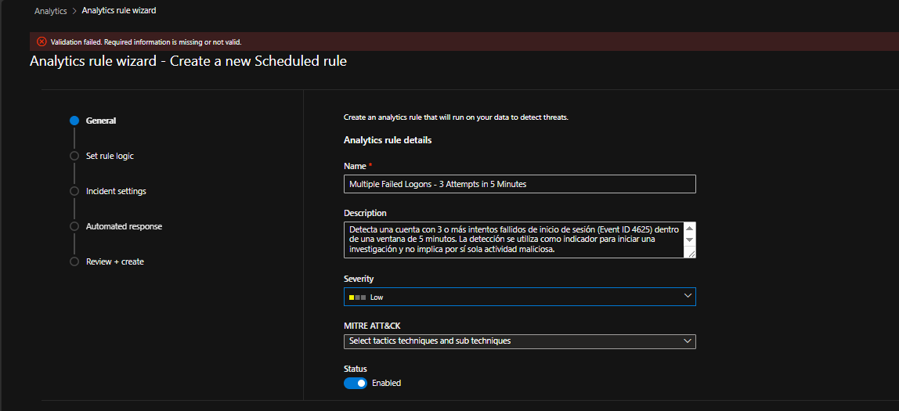

---

## 5. Entity Mapping

Para enriquecer las alertas e incidentes, se configuraron las siguientes entidades:

| Entidad | Identifier | Campo KQL |
|---|---|---|
| Account | FullName | Account |
| Host | HostName | Computer |
| IP | Address | IpAddress |

También se configuró `IntentosFallidos` como Custom Detail para conservar en la alerta la cantidad de intentos que activaron la detección.

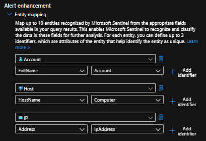

---

## 6. Programación y umbral

La Analytics Rule fue configurada para ejecutarse cada 5 minutos y consultar los eventos correspondientes a los últimos 5 minutos.

La alerta se genera cuando la consulta KQL devuelve más de 0 resultados.

El umbral de 3 intentos no se configura en el Alert threshold de Sentinel, ya que este criterio se encuentra directamente dentro de la consulta:

```kusto
| where IntentosFallidos >= 3
```

Por lo tanto, cualquier resultado devuelto por la consulta ya cumple la condición definida por la detección.

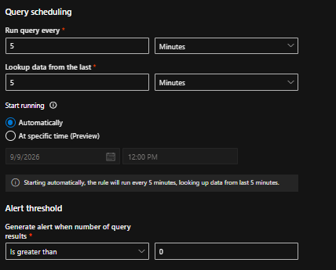

---

## 7. Resumen de configuración

Antes de crear la regla se verificaron los parámetros de detección, Entity Mapping, Custom Details, configuración de incidentes y programación.

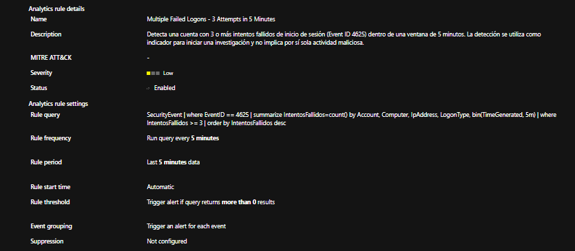

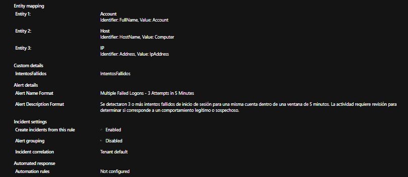

La regla fue creada y habilitada correctamente en Microsoft Sentinel.

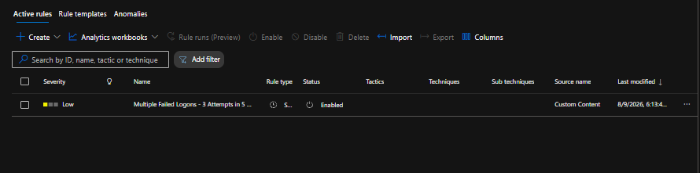

---

## 8. Validación de la detección

Para validar la regla se realizó una prueba controlada generando múltiples intentos fallidos de autenticación en el endpoint Windows.

Los eventos fueron registrados como Event ID 4625 y enviados a Microsoft Sentinel.

La Analytics Rule identificó el patrón y generó automáticamente una alerta y un incidente.

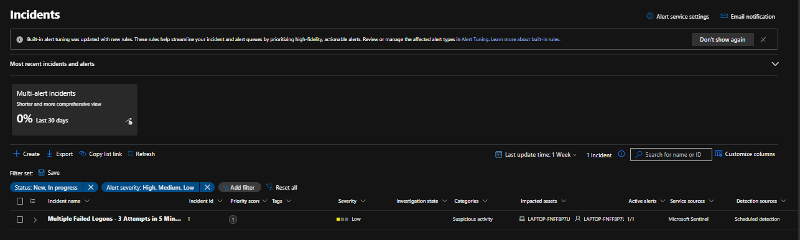

---

## 9. Entidades del incidente

Gracias al Entity Mapping, Microsoft Sentinel relacionó las entidades involucradas en la detección.

Durante la prueba se identificaron:

- Cuenta afectada.
- Endpoint donde ocurrió la autenticación.
- Dirección IP asociada.

El grafo del incidente permitió visualizar la relación entre estas entidades.

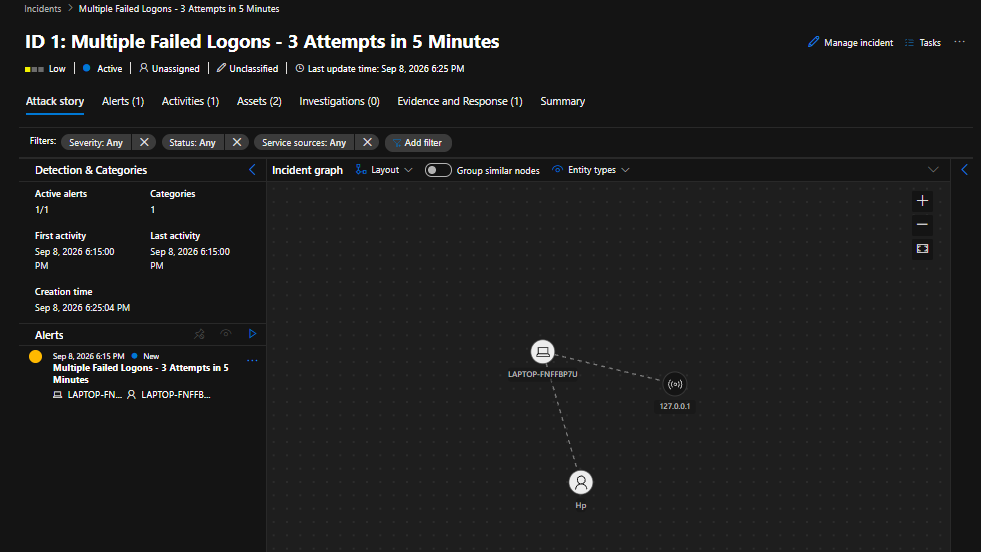

---

## 10. Análisis de la alerta

La alerta generada registró:

| Campo | Resultado |
|---|---|
| Intentos fallidos | 6 |
| IP | 127.0.0.1 |
| LogonType | 2 |
| Severidad | Low |

`127.0.0.1` corresponde a la dirección loopback del equipo y `LogonType 2` representa un inicio de sesión interactivo/local.

El Custom Detail configurado permitió mostrar directamente `IntentosFallidos: 6` dentro de la alerta.

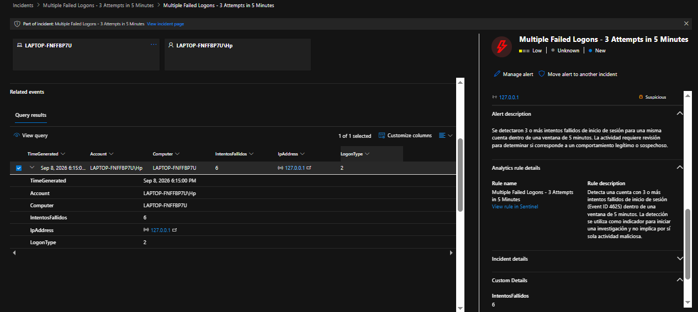

---

## 11. Correlación de eventos

Para realizar el triage se correlacionaron eventos Event ID 4625 y Event ID 4624 correspondientes a la misma cuenta.

La investigación mostró la siguiente secuencia:

- 6 eventos 4625 de autenticación fallida.
- Misma cuenta.
- Mismo endpoint.
- Dirección IP `127.0.0.1`.
- `LogonType 2`.
- Posteriormente se registró un Event ID 4624 correspondiente a una autenticación exitosa.

Esta correlación permitió obtener contexto adicional antes de determinar el resultado de la investigación.

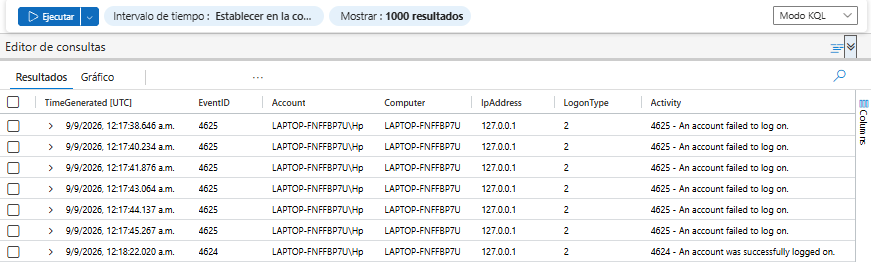

---

## 12. Clasificación y cierre

La investigación determinó que la actividad correspondía a una prueba controlada realizada para validar la regla de detección.

La detección funcionó correctamente: los eventos que cumplían el criterio definido fueron identificados y generaron una alerta.

Sin embargo, la actividad subyacente era esperada y no maliciosa.

El incidente fue resuelto con la clasificación:

`Informational, expected activity - Security testing`

No se identificaron indicadores que justificaran escalamiento o acciones de contención.

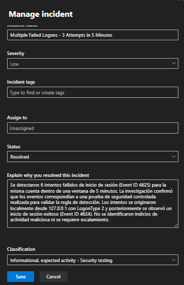

---

## 13. Resultado

La implementación permitió validar el flujo completo de detección e investigación:

```text
Windows Security Event 4625
        ↓
Azure Monitor Agent
        ↓
Log Analytics Workspace
        ↓
Microsoft Sentinel
        ↓
Consulta KQL
        ↓
Scheduled Analytics Rule
        ↓
Alerta
        ↓
Incidente
        ↓
Triage
        ↓
Correlación 4625 / 4624
        ↓
Clasificación
        ↓
Cierre
```

La prueba confirmó tanto la ingesta de telemetría como el funcionamiento de la lógica KQL, la Analytics Rule, el Entity Mapping, la generación de incidentes y el proceso de triage.

---

## 14. Limitaciones y posibles mejoras

Esta primera versión utiliza:

```kusto
bin(TimeGenerated, 5m)
```

para agrupar los eventos en bloques fijos de 5 minutos.

Esto implica que eventos cercanos temporalmente podrían quedar separados si ocurren a ambos lados del límite entre dos bloques.

También se utiliza un umbral bajo de 3 intentos para facilitar la validación dentro del laboratorio. En un entorno de producción, el umbral debería ajustarse utilizando información como:

- Baseline de autenticaciones.
- Tipo de cuenta.
- Origen de la autenticación.
- LogonType.
- Frecuencia histórica.
- Cantidad de usuarios afectados.
- Características del endpoint.

Una futura versión de la detección puede mejorar la lógica temporal y reducir falsos positivos mediante mayor contexto y correlación.

---

## 15. Habilidades aplicadas

Durante el desarrollo y validación de DET-001 se aplicaron conocimientos de:

- Microsoft Sentinel
- Kusto Query Language (KQL)
- Windows Security Events
- Event ID 4625 y 4624
- Scheduled Analytics Rules
- Entity Mapping
- Alert enrichment
- Security monitoring
- Alert triage
- Event correlation
- Incident investigation
- Detection Engineering
- Documentación técnica
