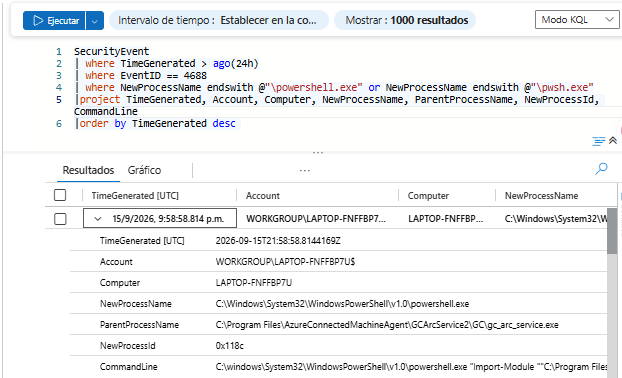
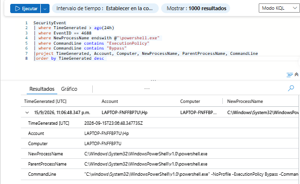
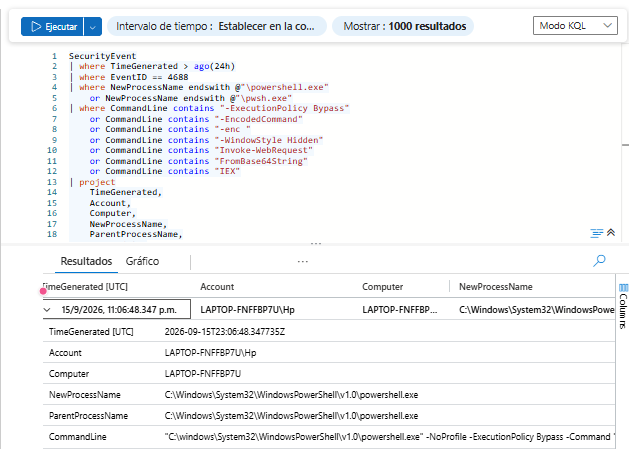
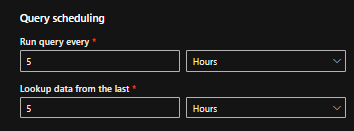
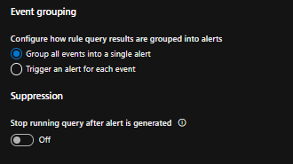
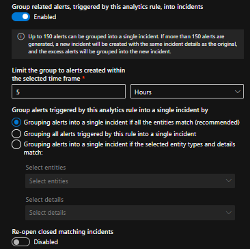
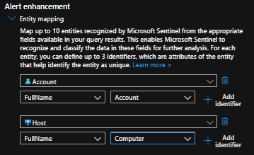
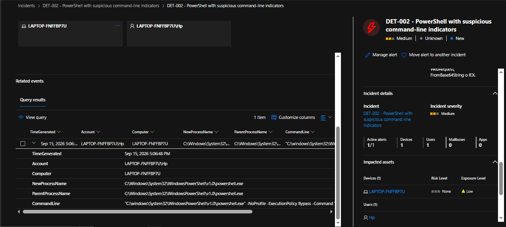
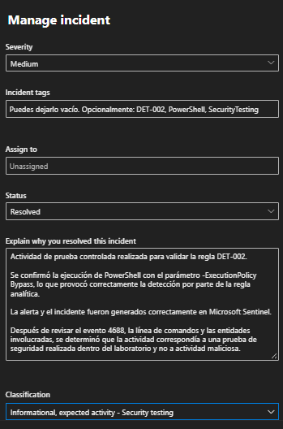

# DET-002 — Detección de ejecución sospechosa de PowerShell

## Resumen

En esta investigación se desarrolló y validó una regla analítica personalizada en Microsoft Sentinel para detectar ejecuciones de PowerShell que contienen parámetros o comandos que pueden requerir investigación por parte de un analista SOC.

La detección utiliza eventos de creación de procesos de Windows correspondientes al **Event ID 4688** y analiza principalmente el campo `CommandLine`.

Durante la prueba controlada se ejecutó PowerShell utilizando el parámetro:

```text
-ExecutionPolicy Bypass
```

Este comportamiento coincidió con los criterios configurados en la regla **DET-002**, lo que provocó la generación de una alerta y posteriormente un incidente en Microsoft Sentinel.

> La presencia de estos parámetros no confirma por sí sola actividad maliciosa. La detección tiene como objetivo identificar comportamientos que requieren análisis adicional.

---

## Objetivo

El objetivo de DET-002 es identificar ejecuciones de PowerShell que contengan indicadores de línea de comandos asociados con técnicas que pueden ser utilizadas tanto para administración legítima como para ejecución de comandos potencialmente sospechosos.

La investigación busca demostrar el flujo completo:

```text
Evento 4688
        ↓
Análisis de CommandLine
        ↓
Consulta KQL
        ↓
Regla analítica
        ↓
Alerta
        ↓
Incidente
        ↓
Investigación SOC
```

---

## Fuente de datos

Los registros utilizados provienen de eventos de seguridad de Windows enviados a Microsoft Sentinel.

### Tabla

```text
SecurityEvent
```

### Evento

```text
Event ID 4688 — A new process has been created
```

Este evento permite analizar información relacionada con la creación de procesos, incluyendo:

- Fecha y hora de ejecución.
- Cuenta que ejecutó el proceso.
- Equipo donde ocurrió.
- Nombre del nuevo proceso.
- Proceso padre.
- Identificador del proceso.
- Línea de comandos utilizada.

---

## 1. Identificación de eventos de PowerShell

Inicialmente se verificó que Microsoft Sentinel estuviera recibiendo correctamente eventos 4688 relacionados con PowerShell.

Se utilizó la siguiente consulta:

```kusto
SecurityEvent
| where TimeGenerated > ago(24h)
| where EventID == 4688
| where NewProcessName endswith @"\powershell.exe"
    or NewProcessName endswith @"\pwsh.exe"
| project
    TimeGenerated,
    Account,
    Computer,
    NewProcessName,
    ParentProcessName,
    NewProcessId,
    CommandLine
| order by TimeGenerated desc
```

### Evidencia



---

## 2. Prueba controlada de ExecutionPolicy Bypass

Para validar la detección se realizó una ejecución controlada de PowerShell utilizando el parámetro:

```text
-ExecutionPolicy Bypass
```

El comando utilizado fue:

```powershell
powershell.exe -NoProfile -ExecutionPolicy Bypass -Command "Write-Output 'Prueba DET-002 PowerShell sospechoso'"
```

Este comando no realiza ninguna acción maliciosa. Únicamente permite generar un evento detectable para validar el funcionamiento de la regla.

Se verificó el evento mediante:

```kusto
SecurityEvent
| where TimeGenerated > ago(1h)
| where EventID == 4688
| where NewProcessName endswith @"\powershell.exe"
| where CommandLine contains "ExecutionPolicy"
| where CommandLine contains "Bypass"
| project
    TimeGenerated,
    Account,
    Computer,
    NewProcessName,
    ParentProcessName,
    CommandLine
| order by TimeGenerated desc
```

### Evidencia



---

## 3. Consulta KQL de DET-002

Después de validar el primer indicador, la consulta fue ampliada para detectar diferentes patrones de interés relacionados con PowerShell.

```kusto
SecurityEvent
| where EventID == 4688
| where NewProcessName endswith @"\powershell.exe"
    or NewProcessName endswith @"\pwsh.exe"
| where CommandLine contains "-ExecutionPolicy Bypass"
    or CommandLine contains "-EncodedCommand"
    or CommandLine contains "-enc "
    or CommandLine contains "-WindowStyle Hidden"
    or CommandLine contains "Invoke-WebRequest"
    or CommandLine contains "FromBase64String"
    or CommandLine contains "IEX"
| project
    TimeGenerated,
    Account,
    Computer,
    NewProcessName,
    ParentProcessName,
    CommandLine
```

### Indicadores utilizados

La regla busca ejecuciones que contengan alguno de los siguientes patrones:

```text
-ExecutionPolicy Bypass
-EncodedCommand
-enc
-WindowStyle Hidden
Invoke-WebRequest
FromBase64String
IEX
```

La condición utiliza `or`, por lo que no es necesario que todos los indicadores aparezcan simultáneamente.

Un solo indicador puede provocar que el evento sea seleccionado para investigación.

### Evidencia



---

## 4. Creación de la regla analítica

Se creó una regla analítica programada en Microsoft Sentinel.

### Nombre

```text
DET-002 - PowerShell with suspicious command-line indicators
```

### Severidad

```text
Medium
```

### Frecuencia de ejecución

```text
Run query every: 5 minutes
```

### Ventana de búsqueda

```text
Lookup data from the last: 5 minutes
```

Esto permite que Sentinel ejecute periódicamente la consulta y revise los eventos recientes.

### Evidencia



---

## 5. Umbral y agrupación

La regla fue configurada para generar una alerta cuando la consulta encuentre uno o más resultados.

```text
Generate alert when number of query results:
Greater than 0
```

De esta manera:

```text
0 resultados → No genera alerta
1 resultado  → Genera alerta
2+ resultados → Genera alerta
```

Los eventos detectados durante la misma ejecución de la regla fueron agrupados para evitar generar múltiples alertas innecesarias.

### Evidencia



---

## 6. Configuración de incidentes

La regla fue configurada para crear automáticamente un incidente cuando se genere una alerta.

```text
Create incidents from alerts:
Enabled
```

También se habilitó la agrupación de alertas relacionadas.

La ventana utilizada fue:

```text
5 Hours
```

La opción para volver a abrir incidentes previamente cerrados permaneció deshabilitada.

### Evidencia



---

## 7. Mapeo de entidades

Para facilitar la investigación del incidente se configuraron entidades relacionadas con la cuenta y el dispositivo involucrados.

### Cuenta

```text
Entity: Account
Value: Account
```

### Equipo

```text
Entity: Host
Value: Computer
```

Esto permite que Microsoft Sentinel identifique automáticamente los activos involucrados y los muestre dentro del incidente.

### Evidencia



---

## 8. Investigación del evento

Una vez ejecutada nuevamente la prueba controlada, Microsoft Sentinel generó correctamente la alerta asociada a DET-002.

Durante la investigación se identificaron los siguientes campos:

```text
TimeGenerated
Account
Computer
NewProcessName
ParentProcessName
CommandLine
```

El proceso identificado fue:

```text
powershell.exe
```

Y la línea de comandos contenía:

```text
-NoProfile -ExecutionPolicy Bypass
```

El campo `CommandLine` fue fundamental para determinar por qué la regla había generado la alerta.

La ejecución coincidió específicamente con el indicador:

```text
-ExecutionPolicy Bypass
```

### Evidencia



---

## MITRE ATT&CK

La detección fue relacionada con la siguiente técnica de MITRE ATT&CK:

```text
Táctica:
Execution

Técnica:
T1059 — Command and Scripting Interpreter

Subtécnica:
T1059.001 — PowerShell
```

PowerShell es una herramienta legítima de administración de Windows, pero también puede ser utilizada para ejecutar comandos, scripts y otras acciones durante diferentes fases de un ataque.

Por esta razón, el uso de PowerShell debe analizarse siempre en conjunto con su contexto.

---

## Análisis SOC

La investigación confirmó que:

1. Se creó un proceso `powershell.exe`.
2. Microsoft Sentinel recibió correctamente el evento 4688.
3. El campo `CommandLine` contenía `-ExecutionPolicy Bypass`.
4. El indicador coincidió con la lógica de DET-002.
5. La regla analítica generó correctamente una alerta.
6. Sentinel creó un incidente para permitir su investigación.
7. Las entidades de usuario y dispositivo permitieron identificar los activos relacionados.

El uso de `-ExecutionPolicy Bypass` no implica automáticamente que exista actividad maliciosa.

En un entorno corporativo real sería necesario correlacionar el evento con información adicional como:

- Usuario que ejecutó PowerShell.
- Proceso padre.
- Comandos ejecutados.
- Scripts relacionados.
- Archivos creados o modificados.
- Conexiones de red.
- Procesos hijos.
- Eventos ocurridos antes y después de la ejecución.

---

## Clasificación

En este laboratorio la actividad fue generada intencionalmente para probar la regla analítica.

Por lo tanto, después de realizar la investigación se determinó que correspondía a:

```text
Actividad de prueba controlada
```

No se identificaron acciones maliciosas adicionales asociadas con el evento.

---

## Conclusión

DET-002 permitió implementar una detección basada en comportamiento utilizando eventos reales de creación de procesos de Windows.

La investigación demostró correctamente el flujo:

```text
PowerShell
    ↓
Event ID 4688
    ↓
CommandLine
    ↓
Indicador detectado
    ↓
KQL
    ↓
Analytics Rule
    ↓
Alert
    ↓
Incident
    ↓
SOC Investigation
```

El laboratorio permitió practicar:

- Análisis de eventos Windows 4688.
- Desarrollo de consultas KQL.
- Análisis del campo `CommandLine`.
- Creación de reglas analíticas.
- Configuración de umbrales.
- Agrupación de alertas.
- Creación automática de incidentes.
- Mapeo de entidades.
- MITRE ATT&CK.
- Investigación y clasificación de alertas.

La regla DET-002 quedó validada correctamente dentro del laboratorio SOC con Microsoft Sentinel.

---

## Resolución del incidente

Después de completar la investigación, el incidente fue cerrado en Microsoft Sentinel.

La actividad fue clasificada como:

**Informational, expected activity — Security testing**

La ejecución de PowerShell fue realizada intencionalmente dentro del laboratorio para validar el funcionamiento de la regla DET-002.

Se confirmó que:

- La regla detectó correctamente `-ExecutionPolicy Bypass`.
- Se generó una alerta.
- Se creó un incidente.
- Se identificaron correctamente el usuario y el equipo involucrados.
- No se observó actividad maliciosa adicional.

Por este motivo, el incidente fue cerrado como una actividad esperada de pruebas de seguridad.

### Evidencia


