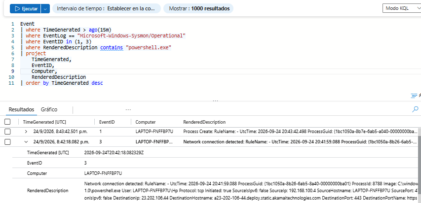
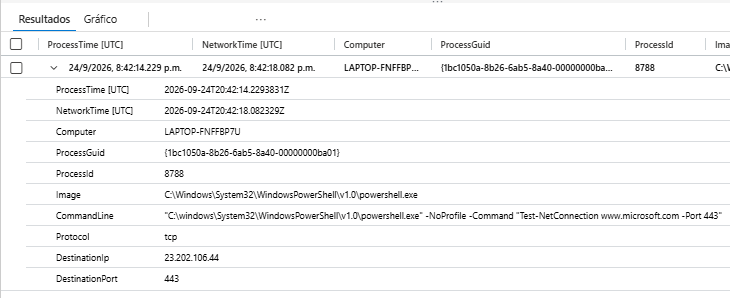
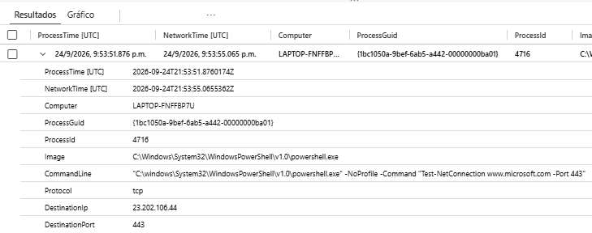
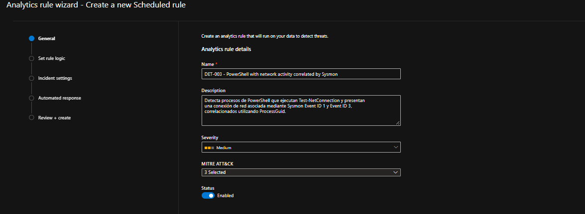
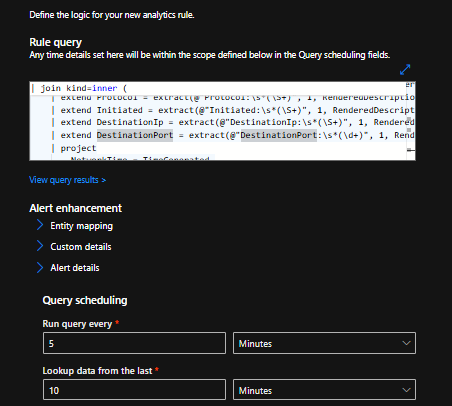
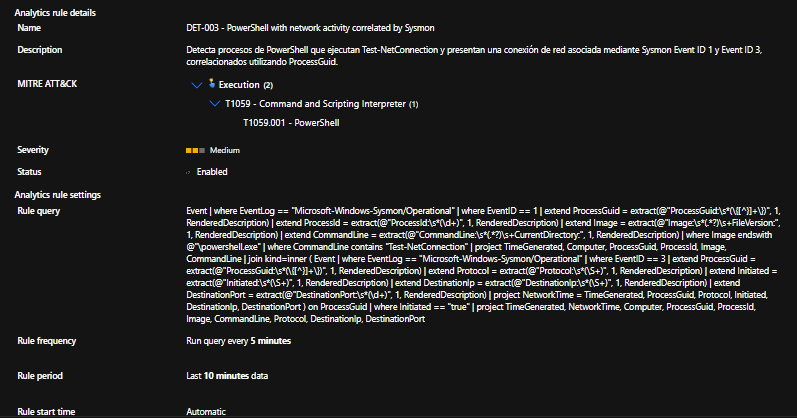
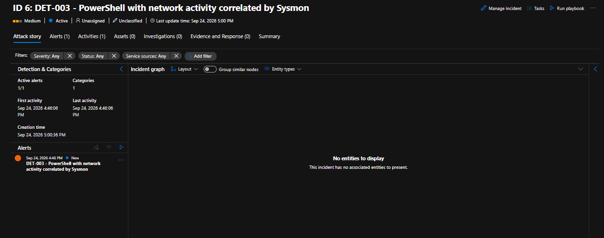
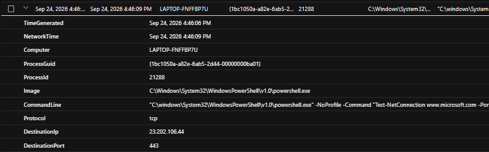
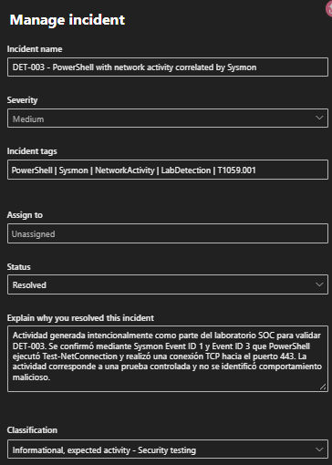

# DET-003 — PowerShell con actividad de red correlacionada mediante Sysmon

## Resumen

DET-003 es una regla analítica desarrollada en Microsoft Sentinel para detectar procesos de PowerShell que ejecutan `Test-NetConnection` y presentan actividad de red asociada.

La detección utiliza telemetría de Sysmon y correlaciona:

```text
Event ID 1 — Process Create
        ↓
    ProcessGuid
        ↓
Event ID 3 — Network Connection
```

La correlación mediante `ProcessGuid` permite comprobar que la conexión de red fue realizada por la misma instancia del proceso de PowerShell observada durante su creación.

---

## Objetivo

El objetivo de DET-003 es detectar automáticamente una combinación de:

```text
PowerShell
+
Test-NetConnection
+
Conexión de red iniciada
+
Mismo ProcessGuid
```

A diferencia de una detección basada únicamente en línea de comandos, esta regla combina telemetría de proceso y red.

---

## Fuente de datos

La regla utiliza eventos recopilados por Sysmon desde:

```text
Microsoft-Windows-Sysmon/Operational
```

Tabla utilizada:

```text
Event
```

Eventos utilizados:

```text
Sysmon Event ID 1 — Process Create
Sysmon Event ID 3 — Network Connection
```

---

## 1. Generación de actividad controlada

Para generar la telemetría necesaria se utilizó PowerShell:

```powershell
powershell.exe -NoProfile -Command "Test-NetConnection www.microsoft.com -Port 443"
```

La ejecución produjo eventos Sysmon relacionados con:

```text
Event ID 1 → creación del proceso PowerShell
Event ID 3 → conexión de red
```

### Evidencia



---

## 2. Correlación entre proceso y conexión de red

Los eventos fueron relacionados mediante `ProcessGuid`.

Los campos principales analizados fueron:

```text
ProcessGuid
ProcessId
Image
CommandLine
Protocol
DestinationIp
DestinationPort
```

La correlación permitió observar en una sola vista:

```text
Image:
powershell.exe

CommandLine:
Test-NetConnection www.microsoft.com -Port 443

Protocol:
tcp

DestinationPort:
443
```

### Evidencia



---

## 3. Consulta KQL de detección

La consulta final utilizada por DET-003 fue:

```kusto
Event
| where EventLog == "Microsoft-Windows-Sysmon/Operational"
| where EventID == 1
| extend ProcessGuid = extract(@"ProcessGuid:\s*(\{[^}]+\})", 1, RenderedDescription)
| extend ProcessId = extract(@"ProcessId:\s*(\d+)", 1, RenderedDescription)
| extend Image = extract(@"Image:\s*(.*?)\s+FileVersion:", 1, RenderedDescription)
| extend CommandLine = extract(@"CommandLine:\s*(.*?)\s+CurrentDirectory:", 1, RenderedDescription)
| where Image endswith @"\powershell.exe"
| where CommandLine contains "Test-NetConnection"
| project
    TimeGenerated,
    Computer,
    ProcessGuid,
    ProcessId,
    Image,
    CommandLine
| join kind=inner (
    Event
    | where EventLog == "Microsoft-Windows-Sysmon/Operational"
    | where EventID == 3
    | extend ProcessGuid = extract(@"ProcessGuid:\s*(\{[^}]+\})", 1, RenderedDescription)
    | extend Protocol = extract(@"Protocol:\s*(\S+)", 1, RenderedDescription)
    | extend Initiated = extract(@"Initiated:\s*(\S+)", 1, RenderedDescription)
    | extend DestinationIp = extract(@"DestinationIp:\s*(\S+)", 1, RenderedDescription)
    | extend DestinationPort = extract(@"DestinationPort:\s*(\d+)", 1, RenderedDescription)
    | project
        NetworkTime = TimeGenerated,
        ProcessGuid,
        Protocol,
        Initiated,
        DestinationIp,
        DestinationPort
) on ProcessGuid
| where Initiated == "true"
| project
    TimeGenerated,
    NetworkTime,
    Computer,
    ProcessGuid,
    ProcessId,
    Image,
    CommandLine,
    Protocol,
    DestinationIp,
    DestinationPort
```

### Evidencia



---

## 4. Configuración de la regla analítica

La regla fue creada en Microsoft Sentinel con:

```text
Name:
DET-003 - PowerShell with network activity correlated by Sysmon

Severity:
Medium

Status:
Enabled
```

### MITRE ATT&CK

```text
Tactic:
Execution

Technique:
T1059 — Command and Scripting Interpreter

Sub-technique:
T1059.001 — PowerShell
```

### Evidencia



---

## 5. Programación y umbral

La regla fue configurada para ejecutarse automáticamente:

```text
Run query every:
5 minutes

Lookup data from the last:
10 minutes

Alert threshold:
Greater than 0

Event grouping:
Group all events into a single alert
```

Esto permite que una correlación válida encontrada por la consulta genere una alerta.

### Evidencia



---

## 6. Regla creada

Después de validar la configuración, DET-003 quedó habilitada en Microsoft Sentinel.

La configuración final mostraba:

```text
Severity: Medium
Status: Enabled
MITRE ATT&CK: T1059.001 PowerShell
Rule frequency: 5 minutes
Rule period: 10 minutes
```

### Evidencia



---

## 7. Generación del incidente

Se ejecutó nuevamente la prueba:

```powershell
powershell.exe -NoProfile -Command "Test-NetConnection www.microsoft.com -Port 443"
```

La regla detectó la actividad y Microsoft Sentinel generó un incidente:

```text
DET-003 - PowerShell with network activity correlated by Sysmon
```

Severidad:

```text
Medium
```

### Evidencia



---

## 8. Investigación de la alerta

Durante la investigación se observaron los siguientes campos:

```text
Computer:
LAPTOP-FNFFBP7U

ProcessId:
21288

Image:
C:\Windows\System32\WindowsPowerShell\v1.0\powershell.exe

CommandLine:
Test-NetConnection www.microsoft.com -Port 443

Protocol:
tcp

DestinationIp:
23.202.106.44

DestinationPort:
443
```

Esto confirmó que la regla correlacionó correctamente el proceso PowerShell con la conexión de red asociada.

### Evidencia



---

## 9. Triage y resolución

La actividad fue generada intencionalmente como parte del laboratorio SOC.

Después de revisar la alerta se determinó que:

```text
PowerShell fue ejecutado intencionalmente.
Test-NetConnection formaba parte de una prueba controlada.
La conexión hacia el puerto 443 era esperada.
No se identificó comportamiento malicioso.
```

El incidente fue cerrado con:

```text
Status:
Closed

Classification:
Informational, expected activity

Classification reason:
Security testing
```

### Incident tags

```text
PowerShell
Sysmon
NetworkActivity
SecurityTesting
T1059.001
```

### Comentario de resolución

```text
Actividad generada intencionalmente como parte del laboratorio SOC para validar DET-003. Se confirmó mediante Sysmon Event ID 1 y Event ID 3 que PowerShell ejecutó Test-NetConnection y realizó una conexión TCP hacia el puerto 443. La actividad corresponde a una prueba controlada y no se identificó comportamiento malicioso.
```

### Evidencia



---

## Lógica de detección

La lógica completa de DET-003 puede representarse como:

```text
Sysmon Event ID 1
        │
        ▼
powershell.exe
        │
        ▼
CommandLine contiene Test-NetConnection
        │
        ▼
ProcessGuid
        │
        ├──────────────┐
        │              │
        ▼              ▼
Process Create     Network Connection
 Event ID 1          Event ID 3
        │              │
        └──────┬───────┘
               │
               ▼
         mismo ProcessGuid
               │
               ▼
         Initiated = true
               │
               ▼
        DET-003 ALERT
```

---

## Resultado

DET-003 demostró cómo Microsoft Sentinel puede correlacionar diferentes eventos de Sysmon para detectar comportamiento relacionado entre procesos y conexiones de red.

La detección avanzó respecto a reglas anteriores al utilizar:

```text
Event ID 1
+
Event ID 3
+
ProcessGuid
+
KQL join
```

en una única regla analítica.

---

## Habilidades aplicadas

- Microsoft Sentinel
- Sysmon
- Event ID 1
- Event ID 3
- KQL
- `extract()`
- `extend`
- `project`
- `join`
- ProcessGuid correlation
- PowerShell analysis
- Network activity analysis
- MITRE ATT&CK
- T1059.001 PowerShell
- Detection engineering
- Alert investigation
- Incident triage
- Incident classification
