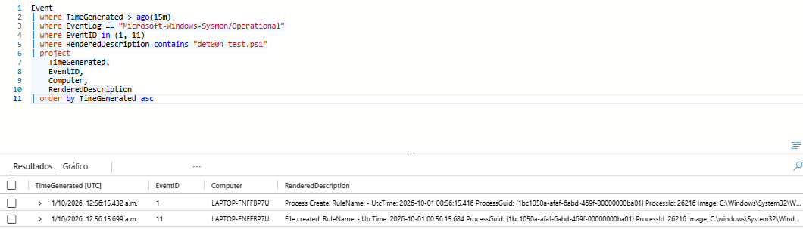
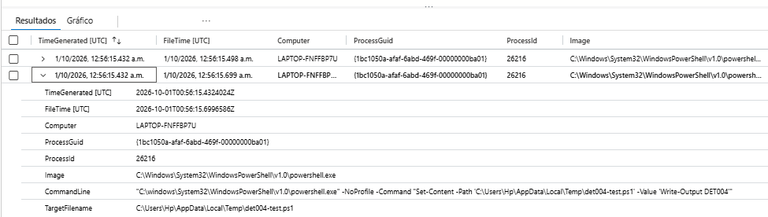
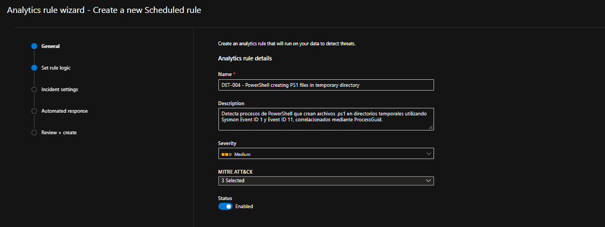
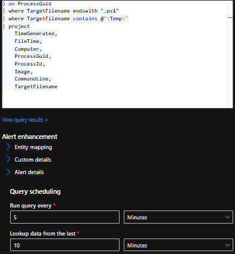
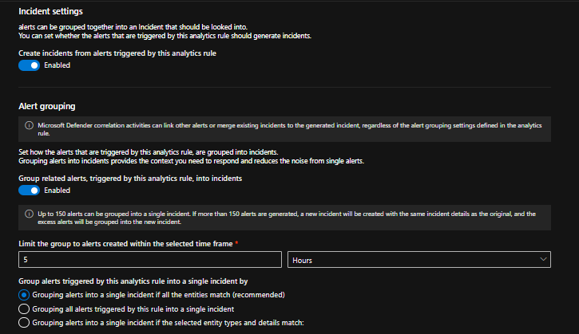
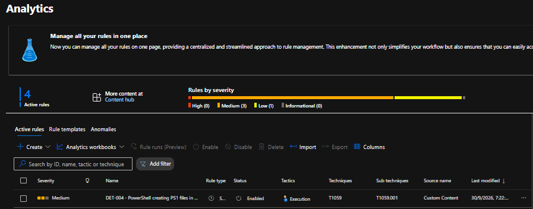
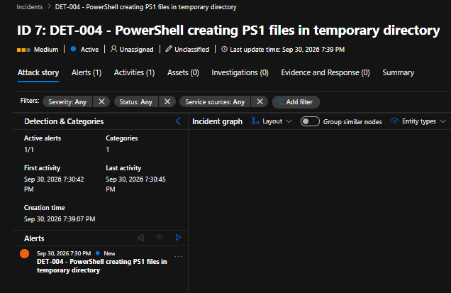
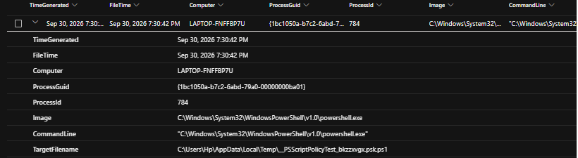
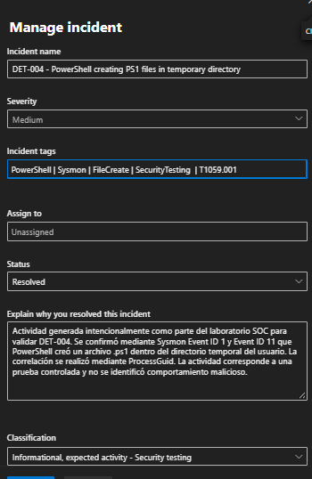

# DET-004 — PowerShell creando archivos PS1 en directorios temporales

## Resumen

DET-004 es una regla analítica desarrollada en Microsoft Sentinel para identificar procesos de PowerShell que crean archivos `.ps1` dentro de directorios temporales.

La detección utiliza telemetría de Sysmon y correlaciona:

```text
Event ID 1 — Process Create
        ↓
ProcessGuid
        ↓
Event ID 11 — File Create
```

La correlación mediante `ProcessGuid` permite comprobar que el archivo fue creado por la misma instancia del proceso PowerShell observada durante su ejecución.

---

## Objetivo

El objetivo de DET-004 es detectar automáticamente una combinación de:

```text
PowerShell
+
Creación de archivo .ps1
+
Directorio temporal
+
Mismo ProcessGuid
```

Esta lógica permite identificar actividad que requiere investigación cuando PowerShell crea scripts dentro de ubicaciones temporales del sistema o del usuario.

La creación de un archivo `.ps1` en un directorio temporal no implica por sí sola actividad maliciosa, por lo que la detección requiere contexto y análisis posterior.

---

## Fuente de datos

La regla utiliza eventos recopilados por Sysmon desde:

```text
Microsoft-Windows-Sysmon/Operational
```

Tabla utilizada:

```text
Event
```

Eventos utilizados:

```text
Sysmon Event ID 1  — Process Create
Sysmon Event ID 11 — File Create
```

---

## 1. Generación de actividad controlada

Para generar la telemetría necesaria se utilizó PowerShell.

El comando ejecutado fue:

```powershell
powershell.exe -NoProfile -Command "Set-Content -Path '$env:TEMP\det004-test.ps1' -Value 'Write-Output DET004'"
```

La ejecución produjo:

```text
Event ID 1  → creación del proceso PowerShell
Event ID 11 → creación del archivo det004-test.ps1
```

### Evidencia



---

## 2. Validación de la lógica de detección

Se desarrolló una consulta KQL para identificar procesos PowerShell que generan archivos `.ps1` dentro de directorios temporales.

La consulta correlaciona Event ID 1 y Event ID 11 utilizando `ProcessGuid`.

```kusto
Event
| where EventLog == "Microsoft-Windows-Sysmon/Operational"
| where EventID == 1
| extend ProcessGuid = extract(@"ProcessGuid:\s*(\{[^}]+\})", 1, RenderedDescription)
| extend ProcessId = extract(@"ProcessId:\s*(\d+)", 1, RenderedDescription)
| extend Image = extract(@"Image:\s*(.*?)\s+FileVersion:", 1, RenderedDescription)
| extend CommandLine = extract(@"CommandLine:\s*(.*?)\s+CurrentDirectory:", 1, RenderedDescription)
| where Image endswith @"\powershell.exe"
| project
    TimeGenerated,
    Computer,
    ProcessGuid,
    ProcessId,
    Image,
    CommandLine
| join kind=inner (
    Event
    | where EventLog == "Microsoft-Windows-Sysmon/Operational"
    | where EventID == 11
    | extend ProcessGuid = extract(@"ProcessGuid:\s*(\{[^}]+\})", 1, RenderedDescription)
    | extend TargetFilename = extract(@"TargetFilename:\s*(.*?)\s+CreationUtcTime:", 1, RenderedDescription)
    | project
        FileTime = TimeGenerated,
        ProcessGuid,
        TargetFilename
) on ProcessGuid
| where TargetFilename endswith ".ps1"
| where TargetFilename contains @"\Temp\"
| project
    TimeGenerated,
    FileTime,
    Computer,
    ProcessGuid,
    ProcessId,
    Image,
    CommandLine,
    TargetFilename
```

La consulta permitió observar:

```text
ProcessGuid
ProcessId
Image
CommandLine
TargetFilename
```

en una sola vista.

### Evidencia



---

## 3. Configuración de la regla analítica

La regla fue creada en Microsoft Sentinel con:

```text
Name:
DET-004 - PowerShell creating PS1 files in temporary directory

Severity:
Medium

Status:
Enabled
```

### MITRE ATT&CK

```text
Tactic:
Execution

Technique:
T1059 — Command and Scripting Interpreter

Sub-technique:
T1059.001 — PowerShell
```

### Evidencia



---

## 4. Programación y lógica de detección

La regla fue configurada para ejecutar automáticamente la consulta.

```text
Run query every:
5 minutes

Lookup data from the last:
10 minutes

Start running:
Automatically
```

El criterio de detección identifica:

```text
powershell.exe
+
TargetFilename termina en .ps1
+
TargetFilename contiene \Temp\
+
mismo ProcessGuid
```

### Alert threshold

```text
Generate alert when number of query results:
Is greater than 0
```

### Event grouping

```text
Group all events into a single alert
```

### Evidencia



---

## 5. Configuración de incidentes

La regla fue configurada para crear automáticamente incidentes cuando se genere una alerta.

```text
Create incidents from alerts triggered by this analytics rule:
Enabled
```

La agrupación de alertas se configuró para evitar generar múltiples incidentes innecesarios relacionados con la misma actividad.

### Evidencia



---

## 6. Regla creada

Después de validar la configuración, DET-004 quedó habilitada en Microsoft Sentinel.

La regla quedó asociada con:

```text
Severity:
Medium

Status:
Enabled

Tactic:
Execution

Technique:
T1059

Sub-technique:
T1059.001
```

### Evidencia



---

## 7. Generación del incidente

Para validar la detección se generó una nueva actividad controlada:

```powershell
powershell.exe -NoProfile -Command "Set-Content -Path '$env:TEMP\det004-alert.ps1' -Value 'Write-Output DET004-ALERT'"
```

La regla identificó correctamente la actividad y Microsoft Sentinel generó un incidente:

```text
DET-004 - PowerShell creating PS1 files in temporary directory
```

Severidad:

```text
Medium
```

### Evidencia



---

## 8. Investigación de la alerta

Durante la investigación se analizaron campos como:

```text
Computer
ProcessGuid
ProcessId
Image
CommandLine
TargetFilename
```

La actividad observada correspondía a:

```text
Process:
powershell.exe

CommandLine:
Set-Content ... det004-alert.ps1

File:
det004-alert.ps1

Location:
Directorio temporal del usuario
```

La relación entre el proceso y el archivo fue validada mediante `ProcessGuid`.

### Evidencia



---

## 9. Triage y resolución

La actividad fue generada intencionalmente como parte del laboratorio SOC.

Durante el análisis se confirmó que:

```text
PowerShell fue ejecutado intencionalmente.
El archivo .ps1 fue creado como parte de una prueba controlada.
La ubicación temporal formaba parte del escenario de validación.
La correlación fue realizada mediante ProcessGuid.
No se identificó comportamiento malicioso.
```

El incidente fue resuelto con:

```text
Status:
Resolved

Classification:
Informational, expected activity - Security testing
```

### Incident tags

```text
PowerShell
Sysmon
FileCreate
SecurityTesting
T1059.001
```

### Comentario de resolución

```text
Actividad generada intencionalmente como parte del laboratorio SOC para validar DET-004. Se confirmó mediante Sysmon Event ID 1 y Event ID 11 que PowerShell creó un archivo .ps1 dentro del directorio temporal del usuario. La correlación se realizó mediante ProcessGuid. La actividad corresponde a una prueba controlada y no se identificó comportamiento malicioso.
```

### Evidencia



---

## Lógica de detección

La lógica completa de DET-004 puede representarse como:

```text
Sysmon Event ID 1
        │
        ▼
powershell.exe
        │
        ├── ProcessGuid
        ├── ProcessId
        └── CommandLine
        │
        ▼
Sysmon Event ID 11
        │
        ▼
TargetFilename
        │
        ├── extensión .ps1
        └── directorio \Temp\
        │
        ▼
Mismo ProcessGuid
        │
        ▼
DET-004 ALERT
        │
        ▼
Incident
        │
        ▼
SOC Triage
```

---

## Diferencia entre INC-004 y DET-004

INC-004 realizó la correlación manual durante una investigación.

```text
INC-004
Event ID 1 + Event ID 11
        ↓
Investigación manual mediante KQL
```

DET-004 convirtió esa lógica en una detección automática:

```text
DET-004
Event ID 1 + Event ID 11
        ↓
Analytics Rule
        ↓
Alert
        ↓
Incident
        ↓
Triage
```

Esto representa el paso desde la investigación manual hacia Detection Engineering.

---

## Resultado

DET-004 permitió automatizar la identificación de procesos PowerShell que crean archivos `.ps1` en directorios temporales.

La detección combina:

```text
Sysmon Event ID 1
+
Sysmon Event ID 11
+
ProcessGuid
+
KQL join
+
File extension
+
File path
```

La regla fue validada correctamente mediante una prueba controlada, generando una alerta y un incidente en Microsoft Sentinel.

---

## Habilidades aplicadas

- Microsoft Sentinel
- Detection Engineering
- Sysmon
- Event ID 1
- Event ID 11
- File Create monitoring
- PowerShell analysis
- KQL
- `extract()`
- `extend`
- `project`
- `join`
- ProcessGuid correlation
- File path analysis
- Analytics Rules
- Alert investigation
- Incident triage
- Incident classification
- MITRE ATT&CK
- T1059.001 PowerShell
